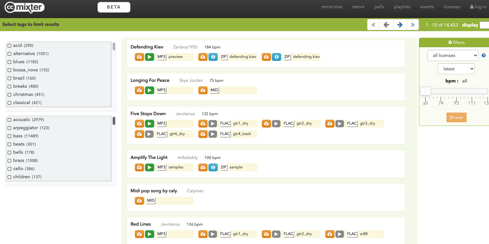

# 自媒体BGM下载，免版权音乐素材网站

不管是剪辑视频还是音频制作，我们都对音乐有大量的需求，那么在哪里能找到免费、高质量又合法的版权音乐呢？文章末尾附赠几百首bgm！

## 音乐网站

### https://musopen.org/music/

该网站主要提供古典音乐资源,包括吉他、大提琴、小提琴等等，所有音乐均可免费下载，值得一提的是该网站还提供大量的乐谱、教材、录音，这些资源也可以免费使用。

需要注意的是，我们在使用这些音乐的时候，每一首音乐有各自的版权声明。

### https://freemusicarchive.org/home

Free Music Archive拥有**超过100,000**首歌曲，通过FMA，可以合法下载高质量的音乐。

### http://beta.ccmixter.org/stems

一个可以随意下载，并且可以分享给任何人，分享到任何地方的音乐网站。

优点在于能快速浏览大量音乐，通过筛选方式获得想要的音乐。可以在线试听、直接下载，每首音乐都有相应的版权授权信息。

### https://www.jamendo.com/start

Jamendo上的所有音乐都是由独立艺术家创作的，个人使用都免费。但用于视频制作或其他商业用途需要遵守该网站的相关条例

### https://cn.imslp.org/wiki/Main_Page

全球最大的免费公共版权音乐网站，网站中的乐谱、音乐都是可以免费下载的，由于该网站涉及的国家很多，在使用的时候需要注意自己国家中的版权条例。

### https://freepd.com/

一个汇集了互联网海量免版税的公共领域音乐资源网站，提供了许多不同类型的音乐资源，你可以下载任意一首音乐，更可以以14美元的价格一键下载全部内容。

### https://icons8.com/music

支持中文，资源以音乐类为主，按照音乐主题，风格流派，表达心情三个大类进行划分，每个大类都有许多小项目。

## 音效网站

### https://www.ear0.com/sound

耳聆网是一个非营利性的音频分享平台，所以这里下载的音效素材全部都是免费的，只要注册登录账号就可以下载。

### https://www.tosound.com/

淘声网不是一个常规的音效素材分享网站，而是一个音效素材的搜索引擎。

通过这个网站，可以搜索音乐、音效两种类型的素材。

### 音乐包

这里是已经下载好的几百首背景音乐，免费分享出来。

链接: https://pan.baidu.com/s/1Ma179xJeY-l-uBPOTzWVcQ?pwd=3898 提取码: 3898

### 使用素材工具

素材工具批量下载视频的时候，同时也会下载音乐，这些音乐也可以直接拿来用。

