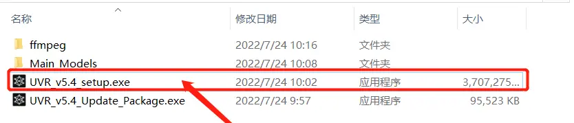
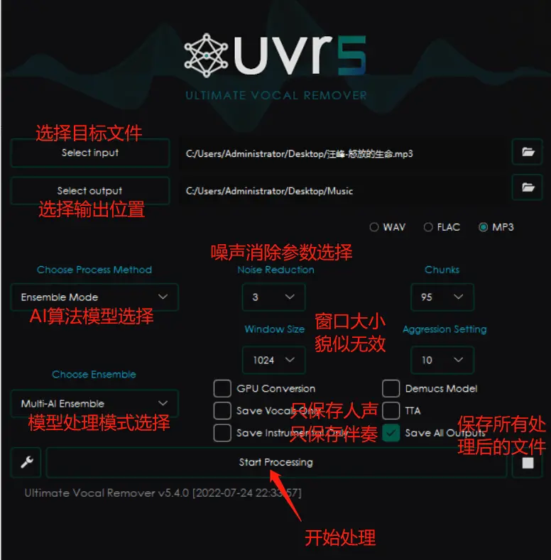
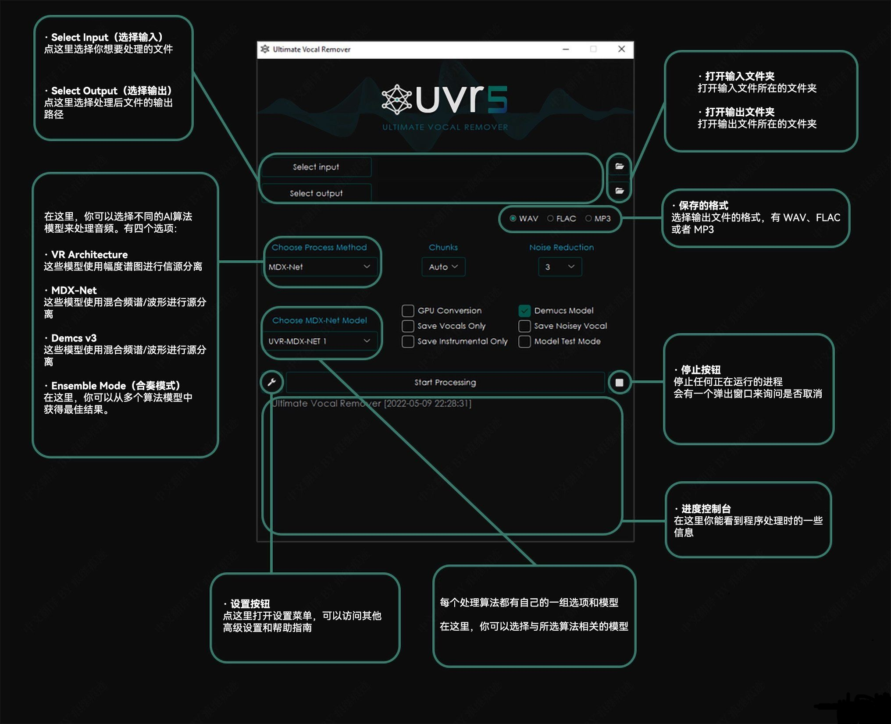
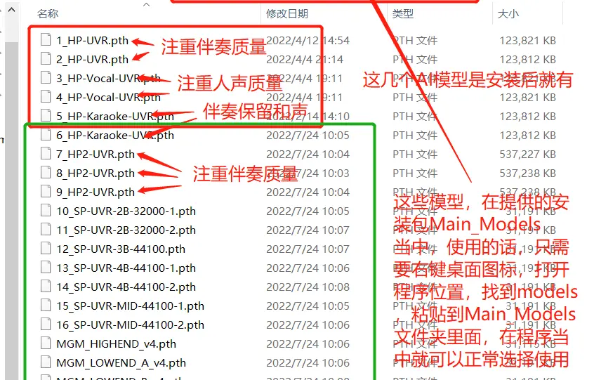

### [Windows] 终极伴奏人声提取【Ultimate Vocal Remover v5.4.0】
非常喜欢各类音乐类型的软件，工作之余偶尔会碰到提取歌曲伴奏以及提取歌曲人声的需求，网络上有很多的软件可以使用，
比如RipX DeepAudio，izotope RX9，SpectraLayers，SpleeterGui等等，一些是开源的，一些是商业软件，
但是在使用过程中总有优劣的选择，不同的人有不同级别的需求（商业软件局限于注册限制，同时商业软件也并非是最好的）。
Ultimate Vocal Remover v5.4.0使用最先进的源分离模型从音频文件中删除人声。
核心开发人员通过AI深度学习训练了此软件中所需的所有模型。
此安装包包含 UVR 接口、Python、PyTorch 以及有效运行应用程序所需的其他依赖项。

请注意：
此安装程序适用于Windows10或者更高版本的系统用户。
Windows7 以下的系统未进行测试，不保证正常运行。
老旧的CPU硬件及系统，不保证程序能够正常运行。
处理过程中非常吃CPU性能，同时也可以选择使用GPU进行处理。
安装路径请勿包含中文。

项目开源地址：GitHub - Anjok07/ultimatevocalremovergui: GUI for a Vocal Remover that uses Deep Neural Networks.

123网盘，百度网盘，天翼云盘链接在帖子最下方：
安装方法：下载完整的数据包后直接运行安装程序进行安装 

AI算法模型提供了好几种分离模型，而且有不同的参数可以调节，我在上传的测试文件中，只选择了最后一种AI模型，调节参数保持默认，导出后的结果就已经很好了，
如果有喜欢研究的朋友，可以尝试使用不同的算法模型，不同的参数设置，也许最终的效果会变得更好。百度网盘已经上传了一组测试处理后的文件，包含原版MP3，
伴奏，人声，效果非常出色！可以自行试听参考。毫不夸张的说，有了他，你可以删除你之前电脑上所有的同类型的应用了，算法最先进的一个程序，没有之一。

训练好的高精度AI模型怎么去选？
只介绍其中3种类型的AI模型，其他的请自行测试效果。因为效果出色，处理时间长（这个因电脑性能决定，表示我的电脑是5年前的本子，现在有点拉跨），
不能挨个测试评价，还请见谅。 

温馨提示：处理的时候CPU是满负荷运转，当然有些玩机党有出色的独立显卡可以勾选使用GPU加速处理，建议设备不太自信的朋友，就用程序安装好后自带的AI模型就行，已经非常出色了，强行使用高精度模型或参数，可能处理一首歌曲的速度时间成几何倍数的增长。
只发精品，喜欢的朋友，记得评分支持一下哦，万分感谢！

123网盘：
https://www.123pan.com/s/1zv8Vv-qgWQ提取码:52PJ
采用分卷压缩，请下载到同一文件夹下面，点击任何一个分卷进行解压

百度网盘:
https://pan.baidu.com/s/1qO7BazmqJVLNQe37Qx_6rw?pwd=52PJ
提取码: 52PJ 复制这段内容后打开百度网盘手机App，操作更方便哦

天翼云盘：
https://cloud.189.cn/t/N7Vvyi2yi2Qb (访问码:3ovx)，大文件貌似需要审核才能下载
采用分卷压缩，请下载到同一文件夹下面，点击任何一个分卷进行解压

关于网盘使用，也想用其他的网盘来着，关键是这安装程序还需要其他的支持库还有AI算法模型在文件夹当中，阿里什么的没办法完整分享，我把整个文件夹全部压缩到一起上传阿里,分享的时候提示不支持此类文件分享,有点坑爹啊，有知道的大神麻烦指导一下，存哪里方便。好多朋友说是蓝奏盘，文件上传大小由限制，AI模型体积大，不方便传到蓝奏。 

作者：三膳来迟 https://www.bilibili.com/read/cv17855326/
作者：hjkh452 https://www.52pojie.cn/forum.php?mod=viewthread&tid=1865179&extra=page%3D2%26filter%3Dtypeid%26typeid%3D231