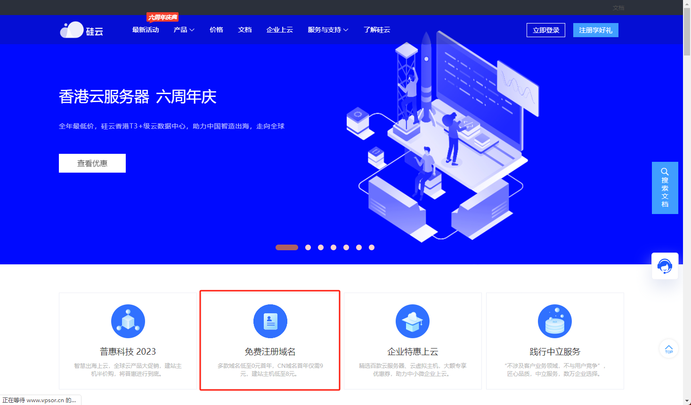

### **免费顶级域名推荐：简易指南**

发布时间：2023-07-04 01: 17:41

 **摘要：本文将介绍一份免费顶级域名推荐指南，帮助读者了解如何选择适合自己的免费顶级域名。本文将从四个方面对该指南进行详细阐述，为读者提供参考。** 

 **一、什么是免费顶级域名** 
 
免费顶级域名是一种免费且高品质的域名服务，它可以将任何符合规定的名称与一个互联网顶级域名绑定，从而让访问者可以轻松地访问您的网站。这种域名服务是经过认证的，意味着您可以相信其安全可靠。但是，免费顶级域名的选择并不像想象中那么简单，因此不同的人需要不同的免费顶级域名指南以确保自己做出正确的选择。

 **二、为什么选择免费顶级域名** 
 
与其他域名服务相比，免费顶级域名有以下优点：

1、免费：与其他域名服务不同，使用免费顶级域名不需要支付任何费用。

2、易于访问：顶级域名是网络上最广泛使用的命名空间之一，因此使用免费顶级域名可以使您的网站更容易被访问。
 
3、提高搜索引擎排名：搜索引擎会更好地识别顶级域名，并将其视为高品质域名，这将有助于提高您的搜索引擎排名。

 **三、如何选择适合自己的免费顶级域名** 
 
选择适合自己的免费顶级域名需要考虑以下几个因素：

1、域名字母数量：建议使用较短的域名，因为它们更容易被记住。不过，域名必须表达您的网站主题和内容。

2、域名的后缀：后缀对于搜索引擎来说也非常重要。选择适合您网站的后缀，有助于提高您的搜索引擎排名。

3、检查域名的可用状态：确认您所选择的域名是可用的。

 **四、顶级免费域名提供商推荐** 
 
以下是几个顶级免费域名提供商的介绍：

1、freenom：freenom是全球最大的免费域名注册商之一。它为用户提供免费域名注册服务，域名后缀包括.tk、.ml、.ga、.gq、.cf等。

2、dot.tk：与freenom类似，dot.tk是另一个提供免费域名的服务商，它提供包括.tk在内的一些非传统的顶级域名。

3、biz.nf：biz.nf为用户提供免费的.biz和.co.nf域名，该服务非常稳定可靠，并提供免费的网站托管服务，因此，您不必再为网站托管服务而烦恼了。

 **五、总结** 
 
本文提供了有关免费顶级域名的简单指南。您了解了什么是免费顶级域名、为什么应该选择它们、如何选择适合的免费顶级域名以及顶级免费域名提供商的推荐。请遵循这些指南，以获得安全、高品质且免费的域名！

便宜vps推荐

《免费顶级域名推荐：简易指南》来自互联网同行内容，若有侵权，请联系我们删除！

===========================================================================

硅云六周年庆典，推出了0元免费域名活动，免费注册.XYZ和.TOP域名，小编亲测免费注册成功！

注册地址：www.vpsor.cn

注册流程：

1、打开注册页面，输入自己喜欢的域名，然后点击查域名；

2、选择.TOP、或者.XYZ后缀的域名注册，看到费用为0元时，提交订单即可。

==========================================================================

3322动态域名那里能免费注册的

在希网是可以注册的。

如何在希网申请域名，首先您要登录其网站先注册个帐号，而后用注册好的帐号和密码登录，然后

在“管理域名”右边窗口输入主机名（免费域名），具体的您可以百度下：希网动态域名申请，有

个百度文库的内容很详细，您可以试试。

另，个人建议注册域名还是到国内正规的，服务品质好点的注册商去注册，交点钱你就是客户，客户是上帝，他们要为你服务；而免费的是他们给你用，主动权在他们手上。总的来说收费的会比免费的更有保障。

如何申请3322免费动态域名

动态域名，是有收费和免费之分，一般家庭都是用免费的，百度一下就能找出好多。在这里以(以前叫)为例。

一、先注册

1.首先，打开。点击：注册。

2.注册四步曲，先填写资料，要求手机。

3.然后，激活邮箱。

4.通过手机认证。

5.恭喜你，注册成功。

二、申请免费域名

1.首先，登陆，输入用户名和密码。

2.找到：PubYunDNS，点击创建DNS解析。在下拉菜单中选择：动态域名设置。

3.设置一个你自己的域名，如：ghws。

4.只要这个域名还没有人用，那么恭喜你，成功了。

5.你的域名全称就是：ghws.f3322.org

三、使用方法及步骤1(通过客户端来使用)

1.先登陆网站，,输入用户名及密码，点击：服务支持-下载客户端。

2.找到适合你电脑系统的客户端。下载。

3.然后安装客户端。

4.安装完成后，打开客户端。

5.设置好登陆的用户名密码等等。

6.成功后，在屏幕右下角可以看到图标。

四、使用方法及步骤2(通过绑定路由器设备来使用)

通过绑定路由器设备来使用，即在外网就可以远程登陆路由器。当然也可以路由器中设置端口映射，以达到使用更多功能。

1.首先，登陆路由器，输入用户名及密码。

2.找到：高级设置下面的动态域名。

3.找到对应的WAN口，点击编辑。

4.先点击启用，再输入免费动态域名的用户名及密码和免费域名。按应用。

5.然后，路由器会提示正在保存，保存完成后，看看有没有连接成功。

6.以上操作成功后，就可以从外网远程登陆路由器了。在地址栏输入：ghws.f3322.org:22222（端口号是也是在路由器里设置的，这样就更安全了）