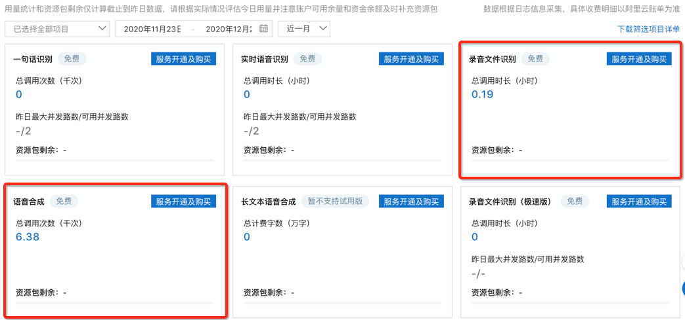

## 1. 登入阿里云，选择智能语音交互

## 2. 选 录音文件合成 和 语音合成

**注意，目前软件只用到了这两个服务**，这里有6个服务，不要买其他的，只有这两个，如果你不需要提取文案功能，那么只买语音合成就够了。

## [计费说明](https://help.aliyun.com/document_detail/207373.html?spm=a2c4g.11186623.2.5.3d0033bf7Fr7hg)

提取文案 用到的是 `录音文件识别`
配音用到的是 `语音合成`