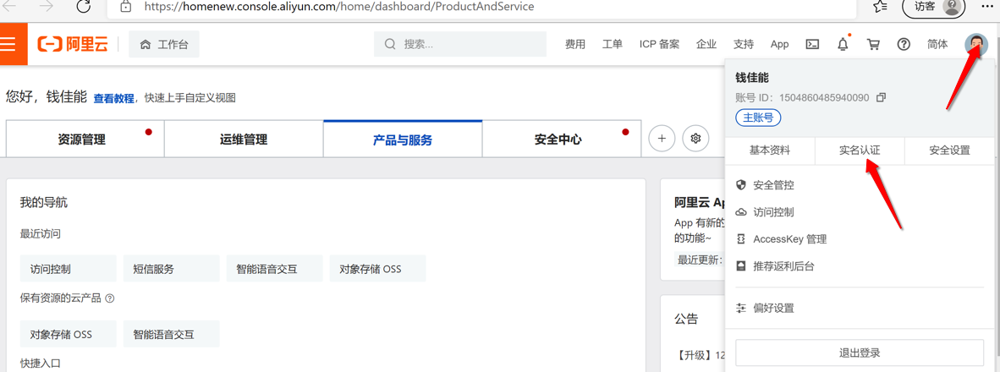
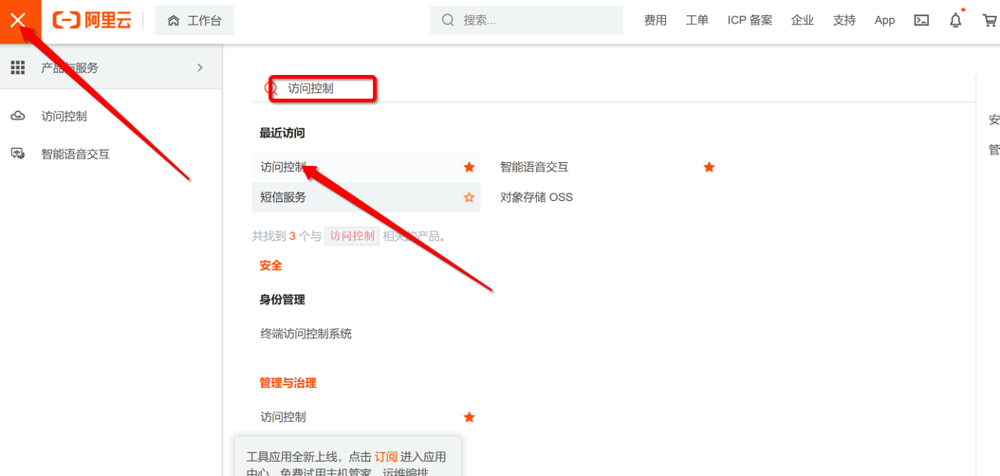
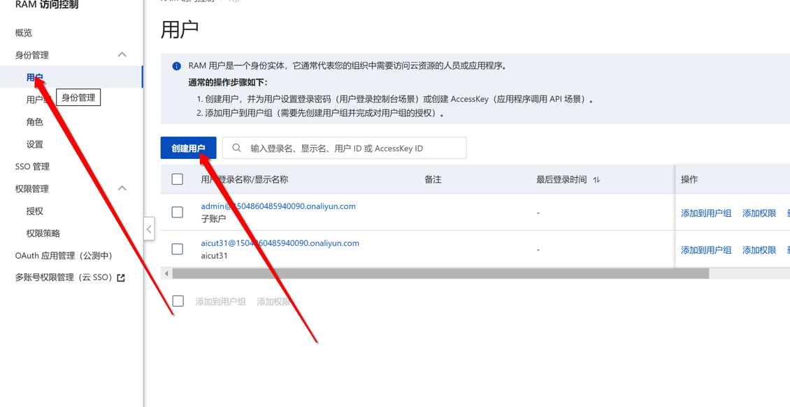
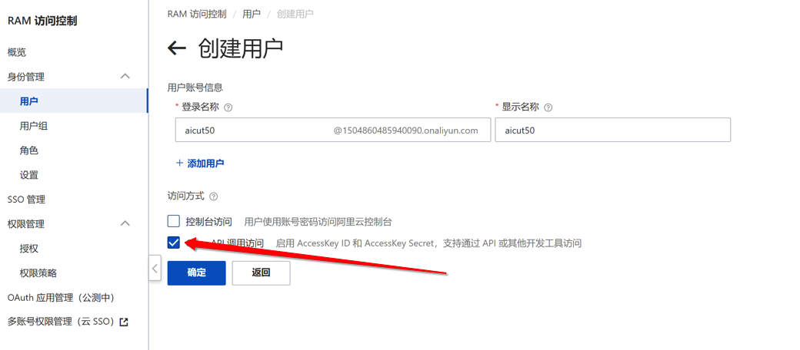
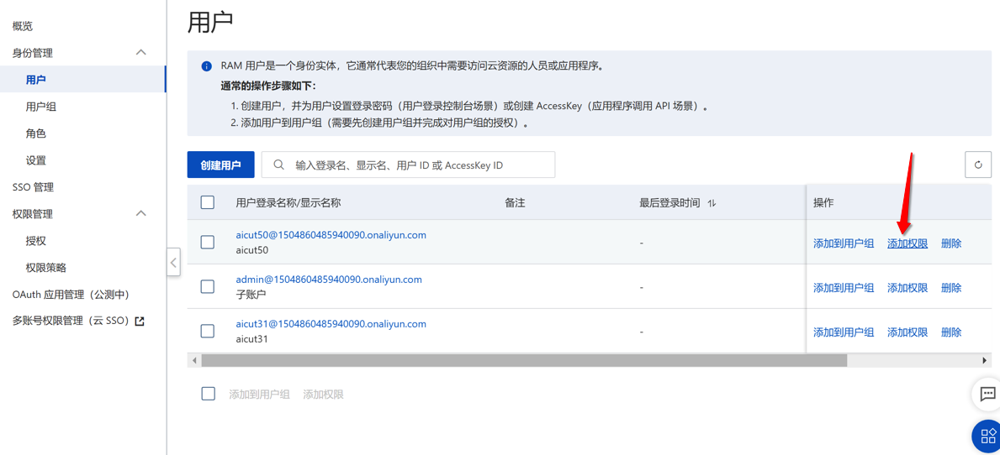
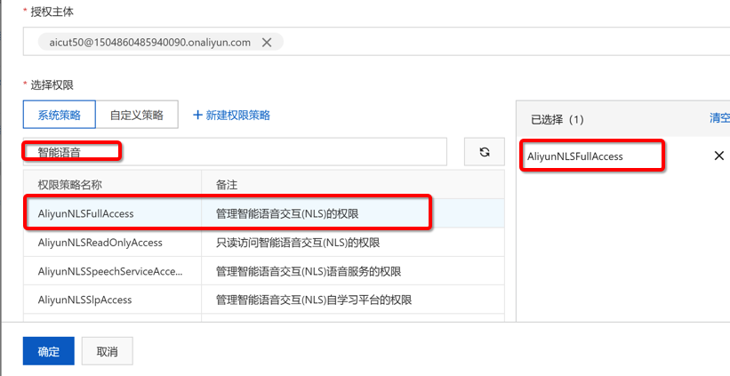
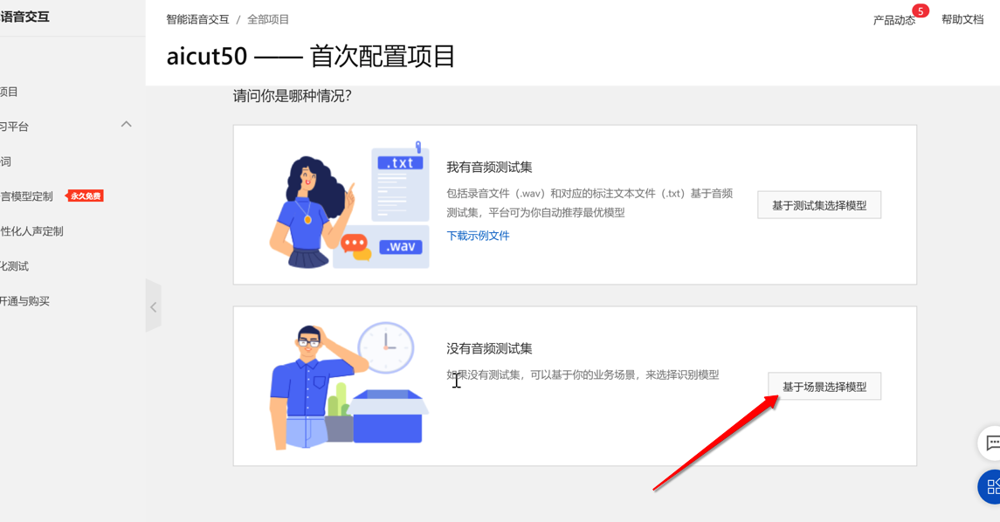
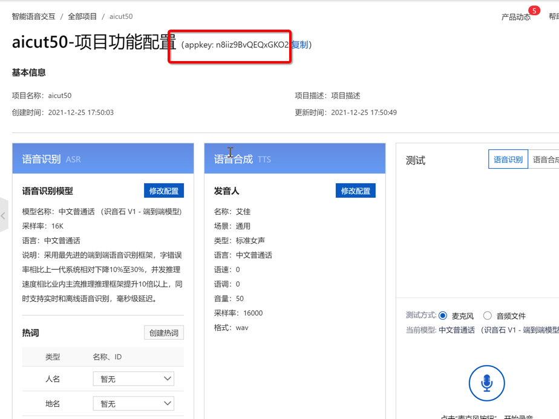

### 视频教程

[点击查看](https://www.bilibili.com/video/BV1Ta41167kv/)

### 图文教程

### 第一步 注册或登入账户并完成实名认证

?> 一定要完成实名认证

?> 一定要完成实名认证

[1. 点击注册或登入账户](https://homenew.console.aliyun.com/)

### 第二步 创建访问控制账户

> 得到 AccessKeyId 和 AccessKeySecret

> 给账户添加权限

### 第三步 开通智能语音交互服务

创建一个项目，得到 appkey

### 其他说明

**注意** 如果阿里云刚开始能用，突然不能用，一般是当天免费额度用完了，可以等第二天，如果过了两天还不能用，则看`参数说明`文档里面的两种一直免费使用阿里云的办法。

如果想省事，就开通付费。

### 其他问题

[如何开通付费](../../platform/ali/buy.md)

无法试听,看[常见问题](https://doc.51ai.top/#/guide/question?id=win7-预览和试听问题)最后一项
