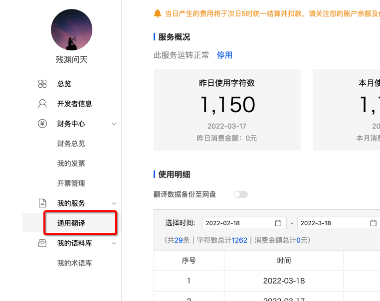
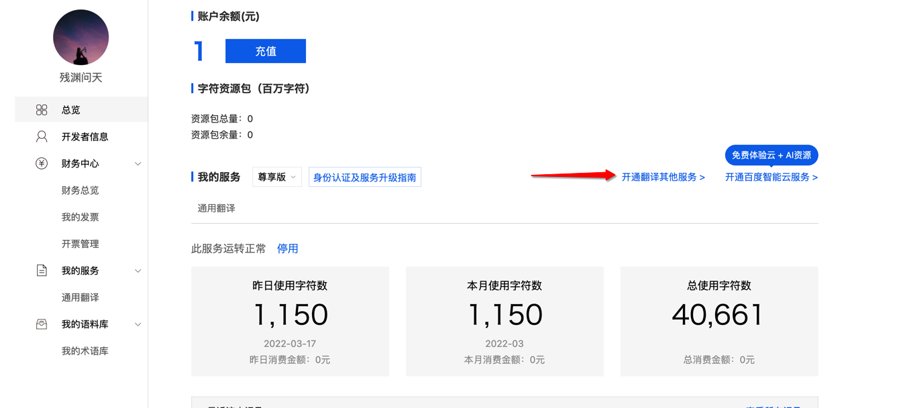
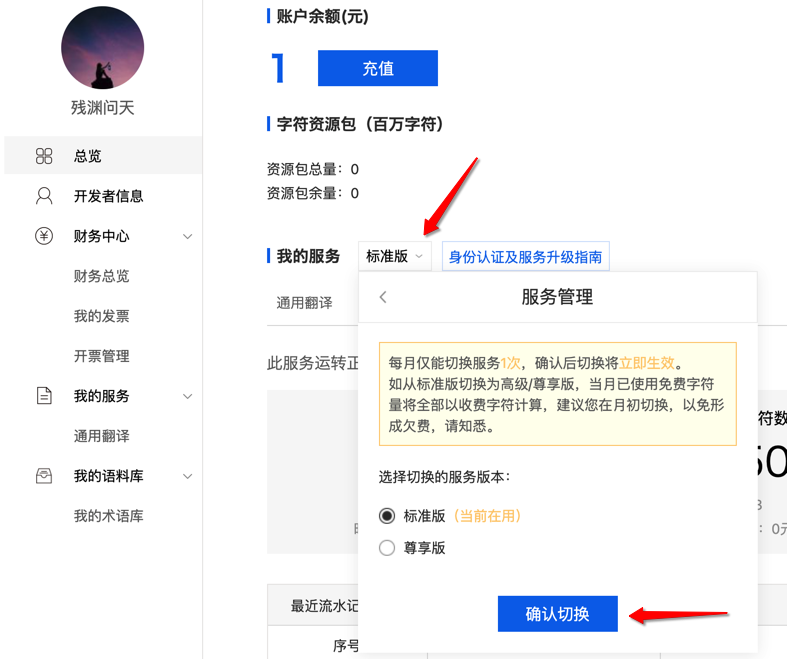

申请网址 [http://api.fanyi.baidu.com/api/trans/product/index](http://api.fanyi.baidu.com/api/trans/product/index)

视频演示 [https://www.bilibili.com/video/BV19v41117GK/](https://www.bilibili.com/video/BV19v41117GK/) 

一般出错的原因有以下3点
1. 账户未实名
2. 翻译类型选错了(错误码52003)，要选择【通用翻译】，具体看下面
3. 首次开通需要等10-30分钟生效

### 翻译类型

确认自己开通的翻译类型是**通用翻译**，如果不是，点击下图所示进行开通

### 认证类型

