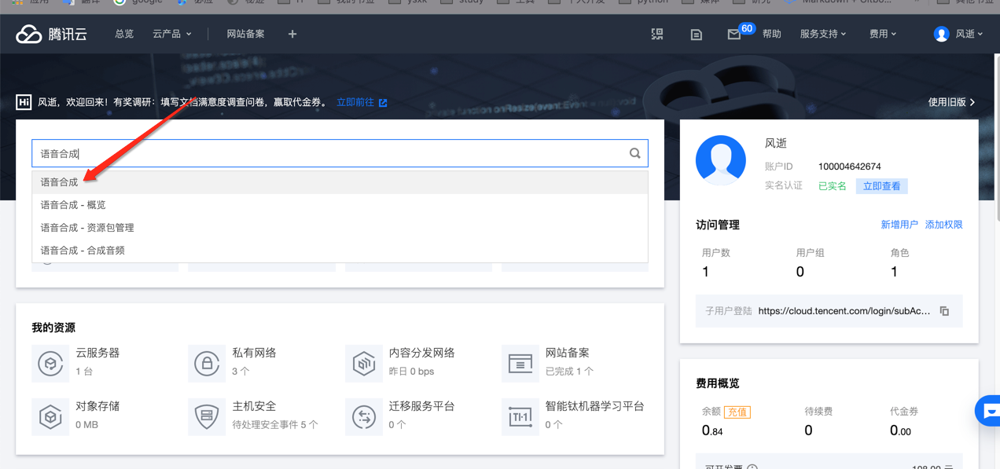
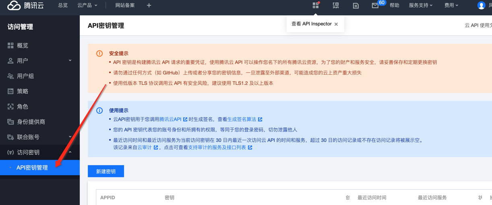

## [视频演示](https://www.bilibili.com/video/BV1kN411Q7oT/)

## 第一步

[点击登入或注册 https://cloud.tencent.com/](https://cloud.tencent.com/)

## 第二步

实名认证，如果已经认证，跳过

## 第三步

[进入访问管理](https://console.cloud.tencent.com/tts)

确认已经实名

## 第四步

## 第五步

## 第六步

[领取免费额度](https://console.cloud.tencent.com/tts/resourcebundle)
领完等几分钟就能用了

## 常见错误

没有实名或者没有领取额度，或者超出了3个月，免费额度用完

