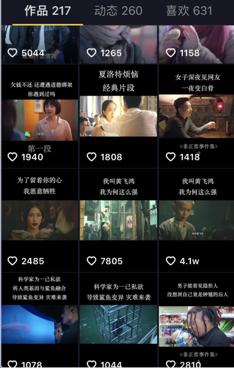
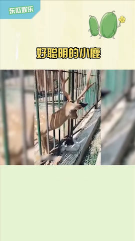
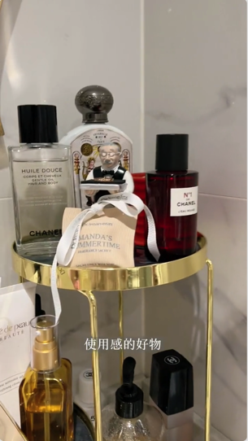
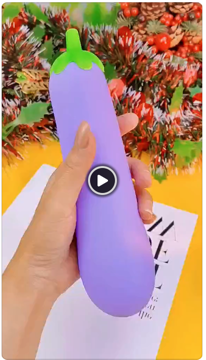
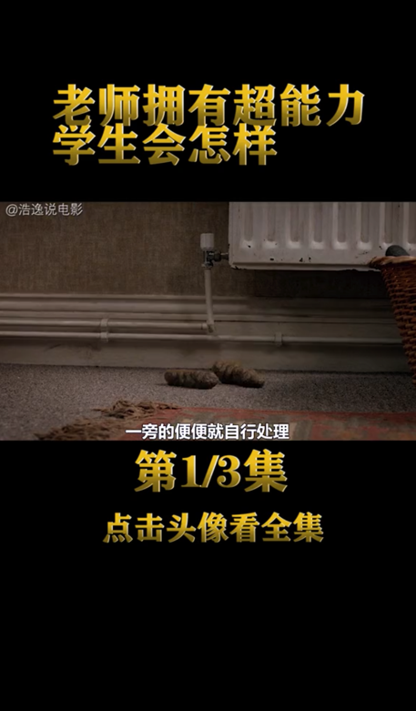

```
有没有 百分之百 通过去重的方法？有，只要把视频改的面目全非就可以，但这并不是我们想要的。
所以去重需要保证视频观赏性的前提下，过机检和人检。
要保证视频观赏性那就必然没有一个统一的方案，根据不同类型的视频，去重手法也不一样，
但是核心是一致的，改动越大，去重效果越好，而改动幅度和观赏性两者之间就需要自己来把控。

```

关于搬运，建议先看下我的这篇文章  [**深度讲解视频去重**](https://www.qikistudio.top/)
如果搬运的视频不加入属于自己创意元素，则任何搬运方法都不可能有100%的把握

先说一下外部因素，有时候外部因素比修改视频更重要。
主要的外部因素有视频题材，视频清晰度，视频发布时间，有无水印，以及我们需要修改的有标题，封面，描述信息等。当然跟账号等级也有关系，但这个不在我们的考虑范围中。

```
简单的说，大致分为两类(画面修改有，加水印，片头尾，特效，画面重组，画中画，蒙版等等)
有配音：去字幕+修改文案后重新配音+去重元素+画面修改
无配音：无水印+去重元素+画面修改+换bgm
```


> 不同的素材搬运方式也不同，本项目不定期更新一些用户咨询过的搬运案例


## 第一类，竖版上下带字幕的视频


[视频演示](https://www.qikistudio.top/)


## 第二类，竖版不带字幕

[视频演示](https://www.qikistudio.top/)

## 第三类，不改变原视频顺序(图片蒙层)

[视频演示](https://www.qikistudio.top/)

## 第四类，两次加工样式


效果图


批量制作素材要求

1. 视频是竖版
2. 视频的分辨率需要一致(如果不一致,调整分辨率一致)

[视频演示](https://www.qikistudio.top/)

## 第五类，小视频带货类配音去重(好物有文案)




教程演示的是用原视频读取模式，也可以提取字幕后，使用txt配音或srt配音

[视频演示](https://www.qikistudio.top/)

## 第六类，带货视频搬运



[视频演示](https://www.qikistudio.top/)


## 第7类，解说搬运



[视频演示](https://www.qikistudio.top/)


## 第8类，美女号

## 第9类，影视片段

## 第11类，情感语录

## 第12类，搞笑合集