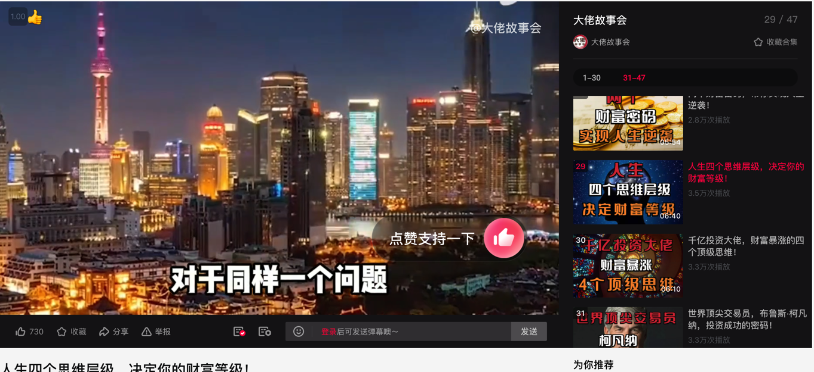
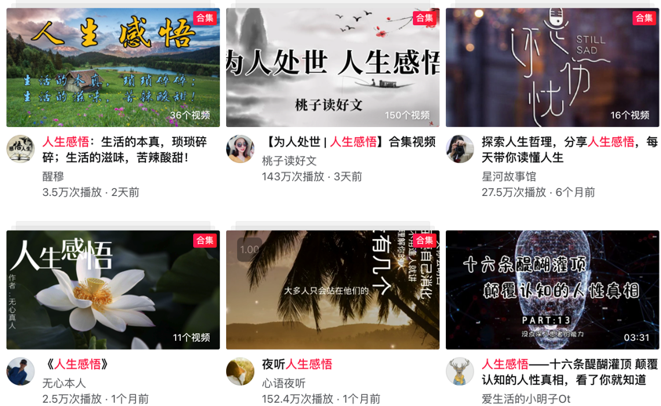
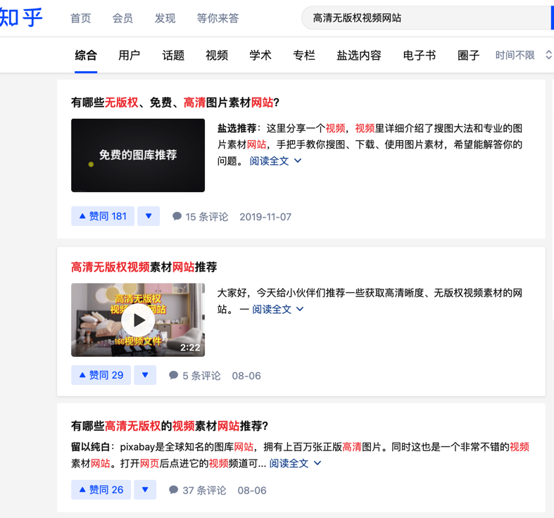
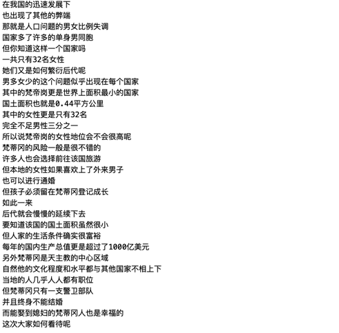

# 中视频计划

普通人，什么也不会，如何参与到各大自媒体的中视频计划中，分到一本羹，喝到一口汤。下面我来手把手教会。

## 开始之前

确定变现模式，再决定视频的类型，不同的变现模式，所适合的视频类型都不太相同

1. 比如你只主要想撸平台的广告收益
2. 比如你只主要想靠带货告获得收益
3. 比如你只主要想靠接广告获得收益

* 适合第一种的类型：两性情感，婚姻出轨，奇闻趣事，男拳女拳，穷人逆袭，女性拜金，贫富差距，故事笑话等
* 适合第二种的类型：财富密码(带书),人生哲学(带书),高情商(带书),
* 适合第三种的类型：这种类型目标群体一定要精准，养生(中老年人)，化妆护肤(职场女性)，

举例

## 第一步，收集素材

#### 视频素材：知乎搜 `高清无版权视频网站`

#### 文案素材

1. [半壁江山](http://joke.banbijiang.com/)
4. [梅花网](https://www.meihua.info/info!0!1)
5. [爱微帮](http://abc.aiweibang.com/hotarticle)
6. [情感励志](http://www.lizhidaren.com/)
7. [搜狗微信](https://weixin.sogou.com/)

#### 音乐素材

关注公众号：【奇客工作室】，发送【音乐包】

## 第二步，素材整理

#### 视频整理

视频下载完后，按照以下方法处理：
1. 如果有片头片尾，去掉
2. 批量分割成每一段20秒左右的视频

#### 文案整理

将每个文案一一保存好，为了有更好的观看效果，处理成一句一行，如果句子短，那就两句一行。
如下效果

#### 音乐素材

音乐不需要处理

## 第三步，批量制作原创视频

视频片段合并+文案+音乐 批量制作

!>[视频演示](https://www.qikistudio.top/)

