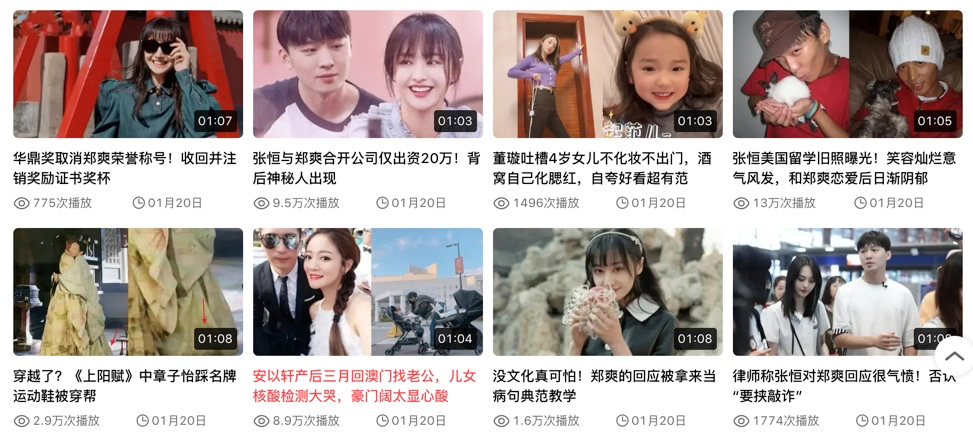

# 精选项目一：娱乐解说

简单看几个案例：
娱乐类

科技类

或者是新闻类，自然类等等都可以。

这种类型的特点是画面和字幕的对应关系不需要很准确，相差个几秒也没有关系，下面举5个例子。手把手教你如何批量生成娱乐解说视频。

> 注意：下面从视频中提取文案的方式，如果发布到头条，需要修改下文案，其他平台问题不大，最好也是修改下文案，毕竟审核机制也只会越来越严格

## 案例一：已有视频 + 文案

这种情况我们需要把文案转化为声音和字幕，然后把声音，字幕加到视频上，最后再加上背景音乐。

[视频演示]()

## 案例二：只有视频

这种情况我们只需要先提取文案，然后操作就跟案例一相同了。
[视频演示]()

## 案例三：啥也没有

这种情况其实就属于搬运，下载无水印视频后，然后操作就跟案例二相同了。如果不知道怎么下载，可以用我们的QiKi采集，完全免费，支持单个采集和批量采集。

要确保去重，去片头片尾，去字幕，修改分辨率，加镜像基本足够。加水印和片头尾效果更好。

采集器地址：https://qikistudio.top/

[视频演示]()

## 案例四：已有图片 + 文案

这种情况只需要把图片合并成视频后，再加配音和字幕以及背景音乐，当然，也是一步到位。
每个目录内支持多个文案：比如教程中，图片的目录内如果放入3个文案，那么最后会输出3个视频。

[视频演示]()

## 案例五：已有视频片段 + 文案

这种情况把视频片段合并成视频后，其他操作跟案例四一致。
每个目录内支持多个文案：比如教程中，图片的目录内如果放入3个文案，那么最后会输出3个视频。

这里有个关键的地方要注意，合并的视频的时长最好要跟文案配音出来的的时长比较接近，否则很费时间。
举个例子：比如文件夹内放了100个视频，每个视频30s，那么总时长就是3000秒，再假设文案配音的长度为1分钟。如果不设置输入数量，那么就会全部视频进行合并，合并完后实际用的就只有前面1分钟，后面多出的部分会被切掉。原本几分钟可以制作完毕，这样一搞没准就几个小时。
这种情况就需要设置输入数量2或者3. 2-3个视频合并的长度最接近1分钟，这样效率最高。

[视频演示]()