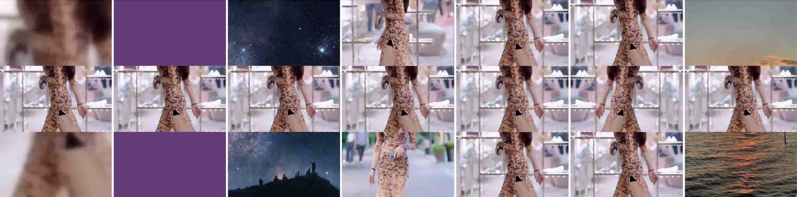

* 如果是竖版的视频，可以直接进行配音，字幕，水印，背景音乐等操作
* 如果是横版的视频，可以先进行加工样式，转换成竖版，下面是7种样式效果

## 模式一：加工样式+文字水印+背景音乐
模式一QIKI剪辑师或者QiKi超级裂变都可以

[视频演示]()

## 模式二：加工样式+配音字幕+文字水印+背景音乐
[视频演示]()

## 模式三：抠像裂变+加工样式+配音字幕+文字水印+背景音乐

竖版就不需要加工样式了，这种方式其实是搬运的一种
[竖版抠像-视频演示]()

[横版抠像-视频演示]

## 模式四：图片合并+加工样式+配音字幕+文字水印+背景音乐

## 模式五：视频合并+加工样式+配音字幕+文字水印+背景音乐

## 模式六：带货搬运

## 模式七：原创裂变推广案例

[视频演示]()

