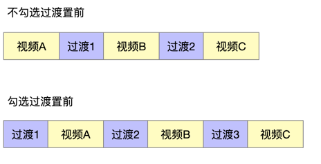

注意点：

1. 先将视频和过渡视频的分辨率调整一致，可以加快速度
2. 过渡置前，适合有顺序的判断。过渡置后，适合搞笑类合集。
3. 顺序问题，如何保证视频片段和过渡视频按照指定的顺序，文件名长度相同的情况下，并且文件名只有数字和字母构成，则文件显示的顺序就是合成的顺序，如果你理解不了这句话，最简单的办法就是按照这种格式去命名文件，001.mp4,002.mp4,...  010.mp4。 按照1，2，3，4的顺序，长度补齐3位。
------------

## mv片段制作教程

主要有两种办法：
1. 去酷狗，youtube，腾讯等平台下载mv 或者直接在抖音下载，然后截取片段 [视频演示]()

2. 用AI快剪 或者 AI 批量制作MV 制作mv，然后截取片段[视频演示]()

    有两种方式
    * 1. 单个制作，可以直接一步到位
    * 2. 批量制作，先批量制作横版MV，然后截取片段，然后再加图片水印，顶部文字和底部文字

如果片段是横版，使用加工样式变成竖版，并加上水印即可

原视频

最终效果

----

## [模式一：片头+mv片段+过渡-批量模式]()
用AI裂变制作方法也是一样

----

## [模式二：自动片头+mv片段+过渡-批量模式](https://)

----

## [模式三：片头+mv片段+过渡-单个模式](https:)

