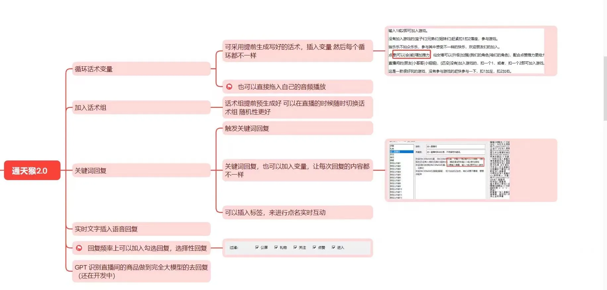

# 【**通天猴AI音频变量**】

---

免责声明：软件仅限个人学习研究使用，禁止使用平台提供的软件发布“刷单/返现/色情/赌博/洗钱/诈骗/”等等违反国家法律禁止的行为和信息，一旦发现即封停账号！其造成的后果与本软件无关！如有软件有侵犯你的权益，联系客服修改删除.

---

软件内置已训练好的多款主播声音，也可训练本人直播声音！
提前写好文字话术，AI语音播报时可随机插入变量文字，实现每段内容都不重复！
AI直播间回复，可随机插入关注，礼物，点赞，进直播间等多种变量回复

---

## <mark>通天猴AI下载地址：</mark>

| 毒盘                                                         | 提取码 |
| ------------------------------------------------------------ | ------ |
| [下载一](https://pan.baidu.com/s/1BauNcmRZ7YhJaUhgv-Gf7g?pwd=53ai) | 53ai   |

---

## <mark>**功能表：**</mark>

---

## <mark>**功能演示：**  </mark>

教程：👉[功能演示](https://pan.baidu.com/s/1vVbqN0N4eSlSvUvJtvqVNQ?pwd=id46)👈 提取码：id46

<!-- <video width="640" height="480" controls>
  <source src="AITTHou.assets/TTHYS.mp4" type="video/mp4">
</video> -->

---

## <mark>**训练好的声音效果演示：**</mark>

## [演示音频试听👈](https://pan.baidu.com/s/1qW9nRlC0QIDeFyE9eBBvhA?pwd=xei6) 提取码：xei6
## 演示 1
<!--  <audio src="qikiclip/AITTHou.assets/1.mp3" loop="loop" controls="controls"></audio> -->
## 演示 2 稍慢
<!--  audio src="qikiclip/AITTHou.assets/2.mp3" loop="loop" controls="controls"></audio!  -->
<!-- <audio src="qikiclip/AITTHou.assets/2.mp3" loop="loop" controls="controls" autoplay="autoplay"></audio> -->
## 演示 3
<!-- <audio src="qikiclip/AITTHou.assets/3.mp3" loop="loop" controls="controls"></audio> -->

---

> # 联系我们

| 公众号                          | 微 信                         |
|:----------------------------:|:---------------------------:|
|  |  |