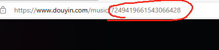

 # 音频ID获取方法

---
> ### 音频ID获取方法，
抖音中找到自己要用的音频 

点开后右上角箭头分享链接

例如：7- 《要学会自己爱自己（剪辑版）》>> https://v.douyin.com/iYyrsXX9/ 7@7.com :3pm

将中间的链接放到浏览器打开，数字部分就是ID。

----
> ## 联系我们

| 公众号                          | 微 信                         |
|:----------------------------:|:---------------------------:|
|  |  |