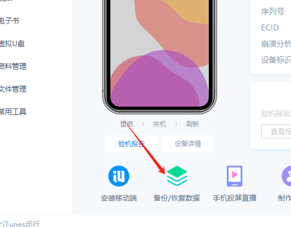
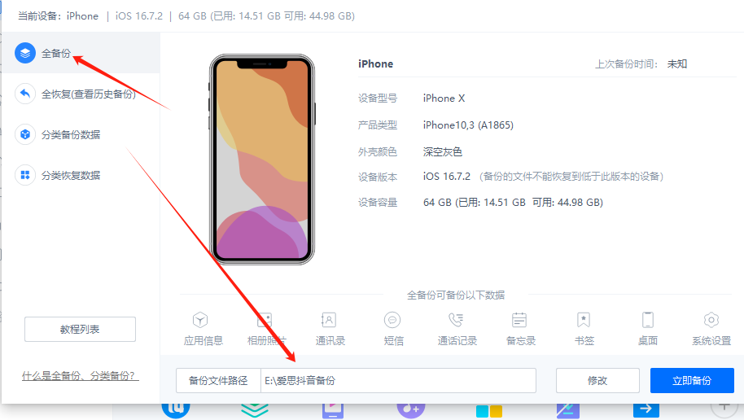

 # 爱思备份包制作

---
> ###  **爱思备份：** 

电脑版爱思、选全备份、

 然后软件上，爱思授权，找到这个目录下找到备份的文件夹就行

----
> ## 联系我们

| 公众号                          | 微 信                         |
|:----------------------------:|:---------------------------:|
|  |  |