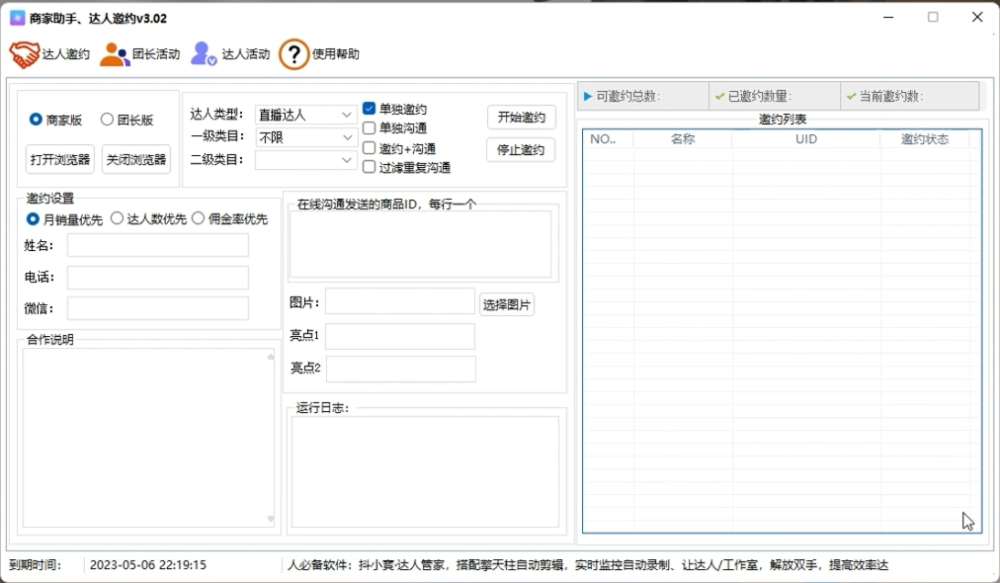
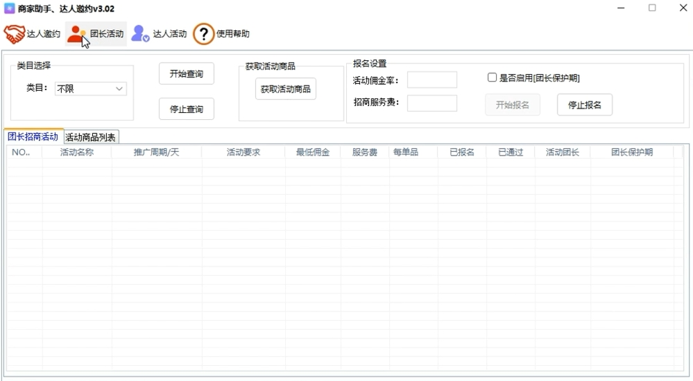
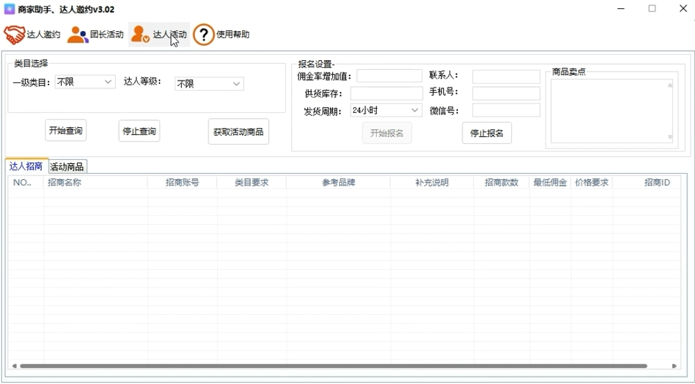

> # 达人邀约、使用教程

---

免责声明：软件仅限个人学习研究使用，禁止使用平台提供的软件发布“刷单/返现/色情/赌博/洗钱/诈骗/”等等违反国家法律禁止的行为和信息，一旦发现即封停账号！其造成的后果与本软件无关！如有软件有侵犯你的权益，联系客服修改删除.

---

| 软件名称     | 版本号     | 下载地址      |
|----------|---------|-----------|
| 达人邀约     | 版本V3.1 | [达人邀约下载地址](https://baoxi.lanzoue.com/i81de1rfyjah)  |
| 谷歌浏览器    | 无       | [谷歌浏览器下载地址](https://baoxi.lanzoub.com/ihmKW0q5sjfe) |
| 一键关闭自带杀毒 | 无       | [一键关闭下载地址](https://wwt.lanzoub.com/iPUi505wpfgj)  |

> ## 1、账号注册登录教程

> ## 2、[邀约，团长活动，达人活动、教程](https://pan.baidu.com/s/1jCrMS-G_4REB5wWiJebT5g?pwd=fkss) 提取码: fkss

> ## 软件界面

1、达人邀约

2、团长活动

3、达人活动

---
> ### 联系我们

| 公众号: 奇客工作室（qikistudio）       | 微信: QIKI5205                |
| ---------------------------- | --------------------------- |
|  |  |