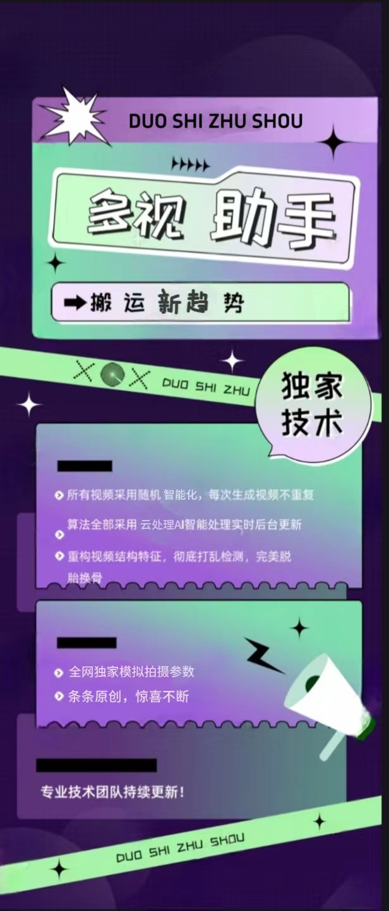
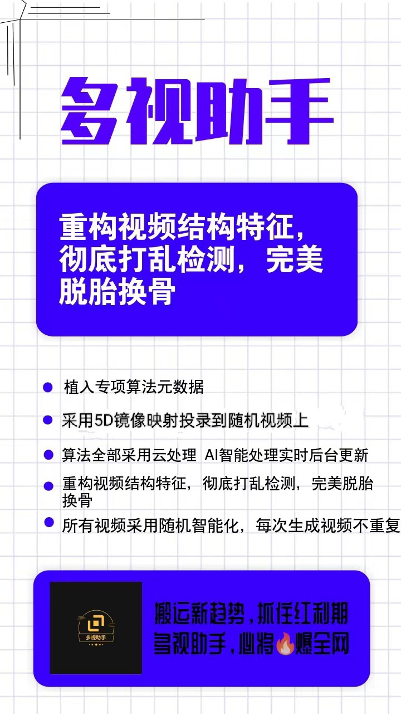
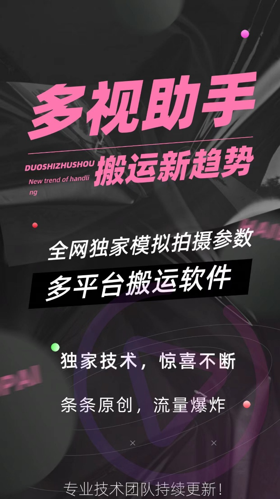

> ## 多视助手，全平台般运新趋势

---

免责声明：软件仅限个人学习研究使用，禁止使用平台提供的软件发布“刷单/返现/色情/赌博/洗钱/诈骗/”等等违反国家法律禁止的行为和信息，一旦发现即封停账号！其造成的后果与本软件无关！如有软件有侵犯你的权益，联系客服修改删除.

---

♨️多视助手内置较强去重逻辑，云端算法，独家支持多平台搬运！
操作简单，一键处理短视频，完美去重。 

1.植入专项算法元数据。 

2.采用5D镜像映射方式把源视投录到随视频上。 

3.算法全部采用云理，AI智能理实时后台更新。 

4.重构视频结构特征，彻底打乱检测，完脱胎换骨。 

5.所有视频采用随智能化，每次生视频不重复。

----

> #### 软件下载

 - 蓝奏云：https://qkcm.lanzouj.com/b013qepdi 密码:83lp

 - 百度云：https://pan.baidu.com/s/1-TJ6XG9b3FlVnrdLNaSixA?pwd=yq36 提取码: yq36 

> #### 支持平台 

 【仅支持安卓手机】
----

