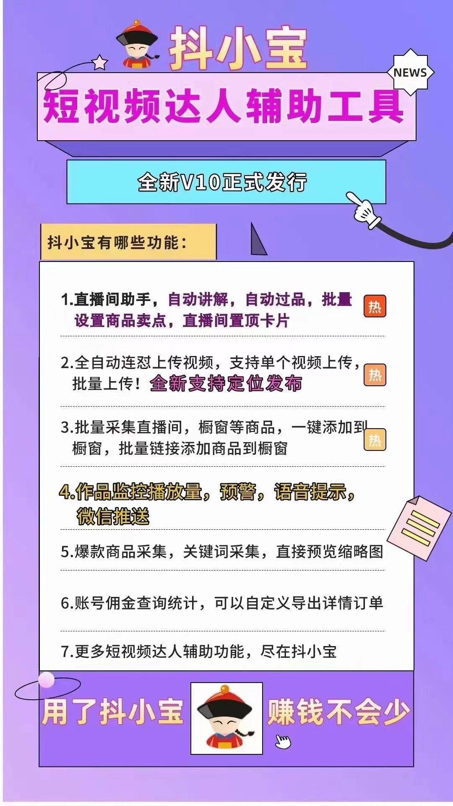

# 抖小寳·达人管家

---

免责声明：软件仅限个人学习研究使用，禁止使用平台提供的软件发布“刷单/返现/色情/赌博/洗钱/诈骗/”等等违反国家法律禁止的行为和信息，一旦发现即封停账号！其造成的后果与本软件无关！如有软件有侵犯你的权益，联系客服修改删除.

---

---
### **[抖小寳·达人管家：视频教程](https://www.yuque.com/douxiaobaovideo/qvdyfe/ezndyn1emphzud9o?singleDoc#)** 

---

### **软件下载**

| 软件名称                       | 版本号     | 下载地址                                                     | 更新日期/说明             |
| -------------------------- | ------- | -------------------------------------------------------- | ------------------- |
| <mark>抖小寳·达人管家</mark>      | 版本v3.37 | [抖小宝·达人管家下载](https://ww0.lanzoul.com/ikB3b26qy55e)     |                     |
| <mark>缺少libcurl.dll</mark> | 无       | [libcurl.dll下载](https://ww0.lanzoul.com/ihyCU26qy00j)    | 系统阉割不完整导致的、解决办法下载补丁|
| <mark>Webview2浏览器</mark>   | 无       | [WebView2浏览器在线包](https://ww0.lanzoul.com/imO7G26qy09i) |                     |

### **安装方法**

如果不熟悉电脑的，请安默认安装设置，自动安装，不要修改路径以及其他的，

如果安装失败，请检查电脑是否有D盘，

如果只有一个C盘，请修改安装路径，

软件只限正常学习使用，如涉及违规行为，发现立即封停有功能需求，

BUG反馈，请联系代理。