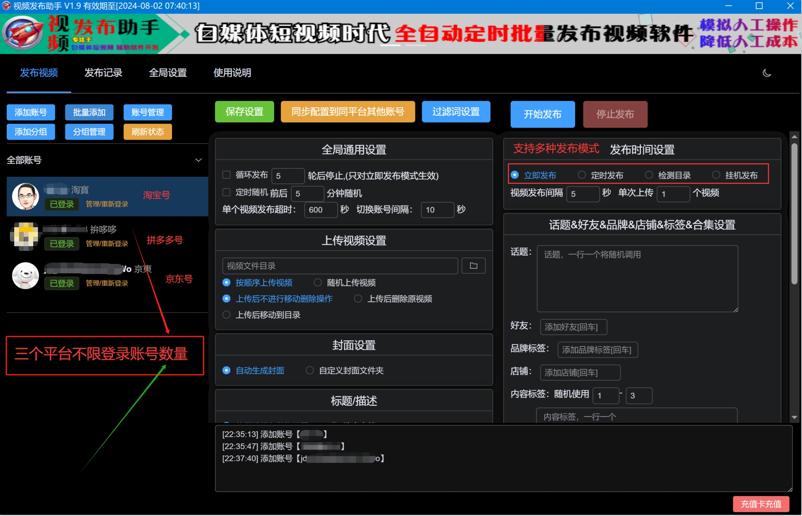
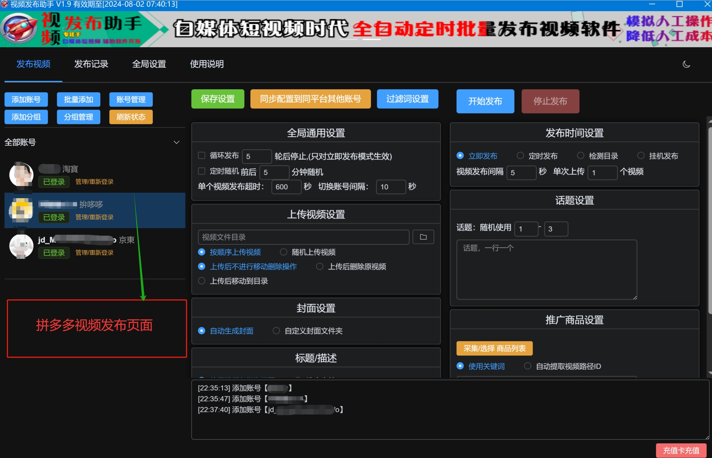
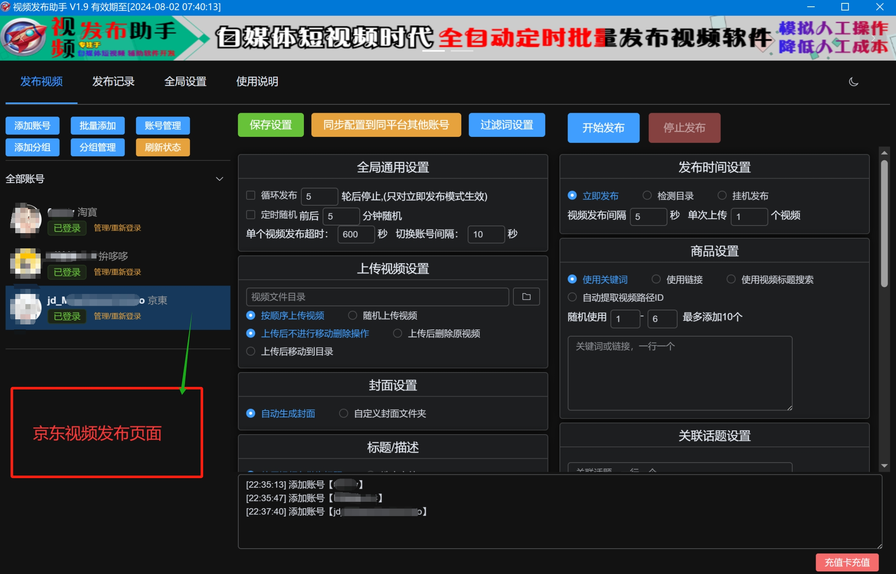

# 淘宝京东拼多多视频发布

---

免责声明：软件仅限个人学习研究使用，禁止使用平台提供的软件发布“刷单/返现/色情/赌博/洗钱/诈骗/”等等违反国家法律禁止的行为和信息，一旦发现即封停账号！其造成的后果与本软件无关！如有软件有侵犯你的权益，联系客服修改删除.

---
### 软件简述：

- 软件仅支持win系统，不支持苹果系统电脑 

- 软件不绑定电脑，任意换机，不限登录三个平台的账号数量

- 软件使用的是网页版模拟协议，电脑网页端手工发布能实现的功能，软件就可以实现批量自动化发布

- 软件支持 淘宝，京东，拼多多三个平台视频发布

---
### 软件下载地址：

| 软件名称                       | 版本号     | 下载地址                                     | 更新日期/说明             |
| -------------------------- | ------- | ---------------------------------------------- | ------------------- |
| <mark>淘拼京视频发布</mark>   | 版本v0 | [蓝奏云](https://ww0.lanzoul.com/b0hc73jla)     |  密码:f9zd |
| <mark>淘拼京视频发布</mark>   | 版本v0 | [毒  盘](https://pan.baidu.com/s/1BcpXaBHlq_BcVeCtieJOVA?pwd=8888)     |  密码:8888 |

 下载：006淘拼京视频发布助手.zip 这个文件，不要下载错了！解压后用 **右键管理员身份运行！ ** 

---
### 软件界面截图：
##### 1.淘宝视频发布页面：

##### 2.拼多多视频发布页面

##### 3.京东视频发布页面

---
> ## 联系我们

| 公众号                          | 微 信                         |
|:----------------------------:|:---------------------------:|
|  |  |