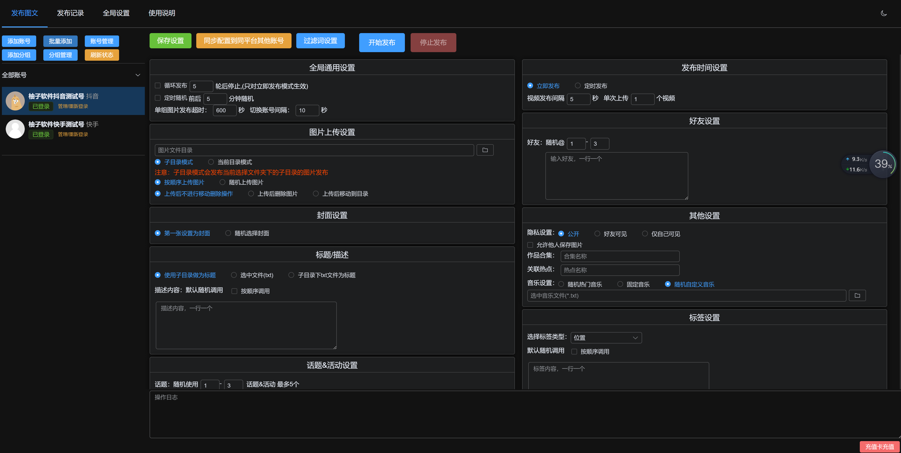
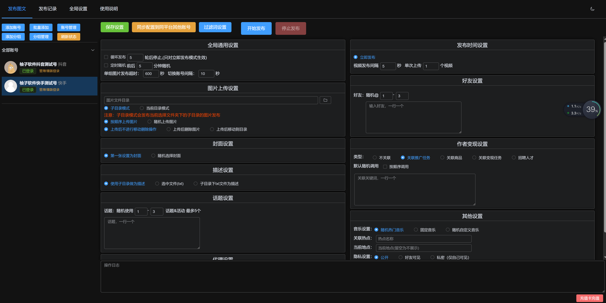
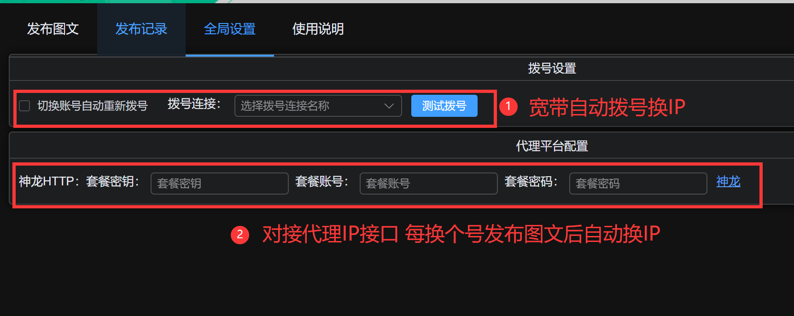

> # 【抖音快手图文发布助手】

---

免责声明：软件仅限个人学习研究使用，禁止使用平台提供的软件发布“刷单/返现/色情/赌博/洗钱/诈骗/”等等违反国家法律禁止的行为和信息，一旦发现即封停账号！其造成的后果与本软件无关！如有软件有侵犯你的权益，联系客服修改删除.

---

- <mark>win</mark>系统使用，不支持苹果电脑<mark>mac</mark>系统
- 支持<mark>抖音/快手</mark>，2个平台图文批量定时发布
- 不绑定使用的<mark>账号</mark>，<mark>不绑定</mark>电脑，随意换机
- 支持<mark>换ip</mark>功能，支持<mark>代理ip</mark>和<mark>宽带拨号</mark>模式换IP

---

> ### 抖音快手图文发布助手  <mark>下载地址</mark>：

| [蓝奏云](https://qkcm.lanzouj.com/b012z7gxa) | 密码:c7n4 | 毒盘  | 密码  |
| ----------------------------------------- | ------- | --- | --- |

###### 下载文件夹内编号：<mark>007抖音快手图文发布助手</mark>，不要下载错了！下载后一定要先解压再使用！

---

> ### 软件界面截图：

1：抖音发布设置界面

2：快手发布设置界面

3：宽带换IP和代理IP设置界面

----

> ### 获取体验卡

| 公众号: 奇客工作室（qikistudio）       | 微信: QIKI5205                |
| ---------------------------- | --------------------------- |
|  |  |