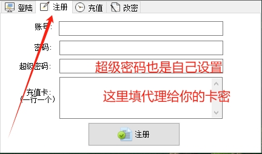
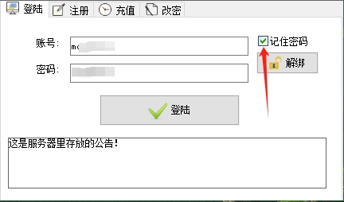
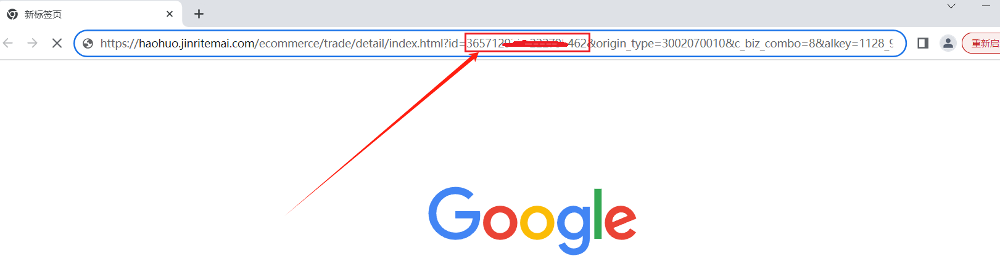
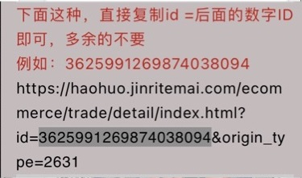
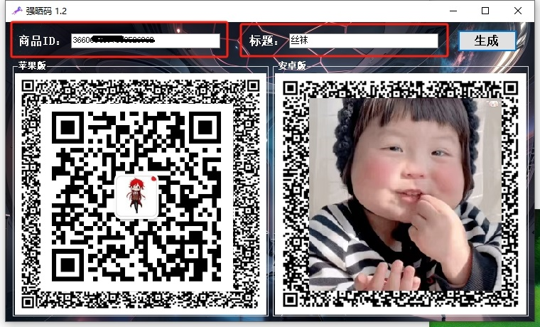
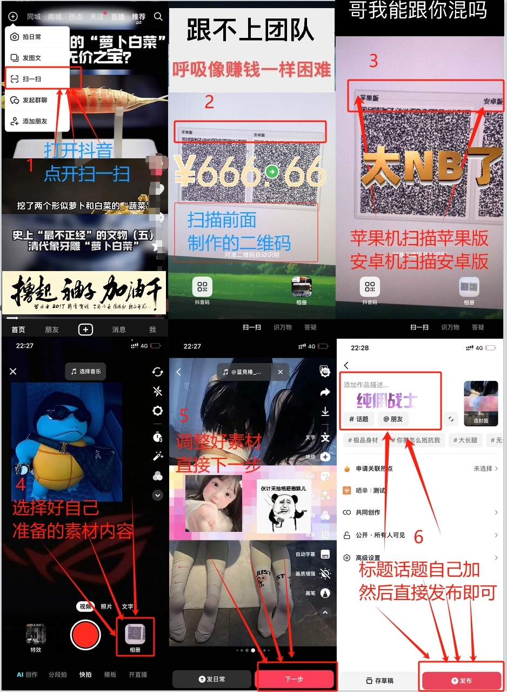

# 晒单码Ⅱ - 使用指引

---

> ## 一、注册

> ## 二、登录

> ## 三、商品 ID 获取

!> 方法一 有抖店的商家，直接在自己店铺后台复制商品ID即可。

!> 方法二 无店铺达人，手动获取ID方法👇👇👇。

  #### 1、在抖音商城复制分享链接

  #### 2、浏览器打开该链接，即可看到商品ID。

---

> ## 四、发布步骤
#### <mark>新版扫码前必须先完成→ 抖音拍单、签收、评价x2、出现“拍晒单” 或 “查看评价” 按钮即可。</mark>

1. 打开抖音扫一扫。
2. 扫描制作好的二维码。
3. 安卓扫描安卓版，苹果扫描苹果版。
4. 选择自己做好的素材。
5. 调整好素材，直接下一步。
6. 填写文案内容，添加流量标签。
7. 发布。

---
?> 答疑：

1、扫码发布后作品右下角没有显示购物车

  答：店铺需要过新手期，开精选联盟。

2、设置的标题发布后没标题。

  答：平台关闭了标题自定义接口，晒单默认使用商品原始标题

---

> ## 联系我们

| 公众号                          | 微 信                         |
|:----------------------------:|:---------------------------:|
|  |  |