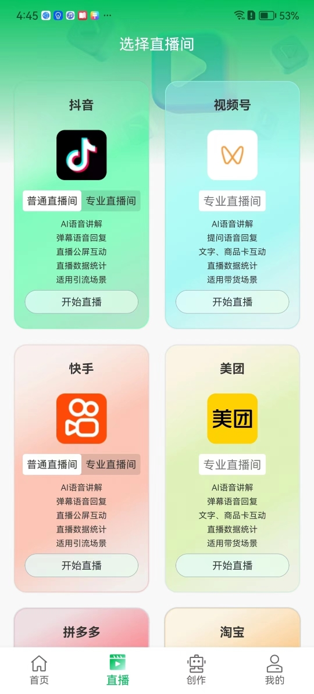
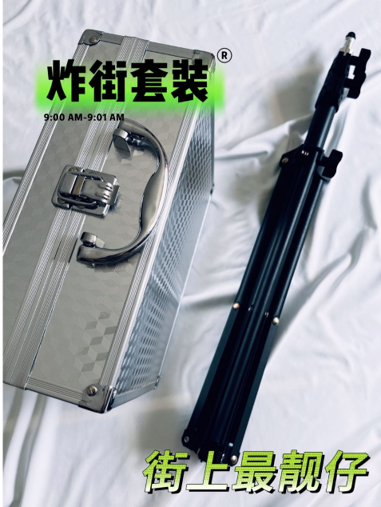
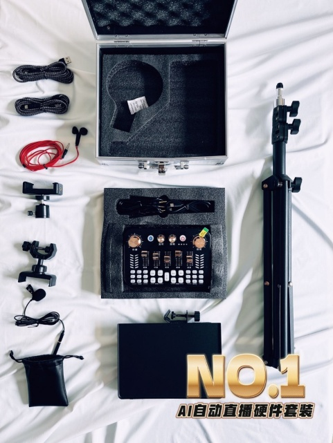

# 实体商家自动直播

---

免责声明：软件仅限个人学习研究使用，禁止使用平台提供的软件发布“刷单/返现/色情/赌博/洗钱/诈骗/”等等违反国家法律禁止的行为和信息，一旦发现即封停账号！其造成的后果与本软件无关！如有软件有侵犯你的权益，联系客服修改删除.

---

> # 更新进度/计划

目前兼容抖音团购直播，抖音小店直播，抖音巨量小店直播

新增快手普通直播

快手专业直播功能

目前已兼容抖音团购直播

抖音小店直播

视频号直播

<mark>后期开发计划</mark>

美团直播

拼多多直播

小红书直播

淘宝直播

---

> ### <mark>安卓实景智播app软件下载地址：</mark>

（手机电脑请用浏览器打开）

http://syxjl.daosanjun08.com/app/index

---

<mark>手机端软件设置教程：</mark>

<mark>声卡与手机链接教程：</mark>

直播声卡组合套件（可联系代理购买，价格不高）

声卡

耳机

3.5音频线

设备箱子

防震海绵

直播支架[加厚磨砂]

声卡铁艺托盘

金属万向头

一字夹

多机位夹

收音麦克风

OTG线苹果+安卓2条

包装箱加厚5层

---

## **<mark>商家无人直播硬件必备：</mark>**

 1、一部正常直播的手机（可以是苹果，也可以是安卓） 

2、直播支架（可自行购买，一般几十） 

3、带蓝牙功能的声卡（可自行购买，一般100多即可） 

4、一部安装无人直播软件的手机（安卓） 

5、配件：

直播手机声卡转换器（一口连接声卡，一口连接充电线）、

耳机（连接声卡，用来监听声音是否正常），

麦（连接声卡，用来拾取环境音，或者真人参与直播）

---

## <mark>核心解决线下商家直播的痛点：</mark>

1. <mark>直播需要主播的痛点 </mark>
   
   直播时，需要主播一直在有语音的互动话术，这点商家基本很难做到 
   
   这款无人直播系统，是通过提前录制好的语音话术，进行循环播放  
   
   比如：产品套餐录一条，比如店铺环境录一条，比如用料吃法录一条等等 

2. <mark>直播时需要主播，与观众进行互动的痛点 </mark>
   
   而平时商家很忙，不会专门指定员工来做这件事 
   
   而这款无人直播系统，可以设置好关键词，以及对应的回复语音，来解决这个问题 
   
   在公屏有人咨询 ，比如”在哪里“、”地址是哪“等，通过关键词智能识别，自动用语音来回复客户 通过这两个功能即可实现直播讲解和公屏互动回复，从而取代真人主播直播。 

3. <mark>而它的成本优势在哪里呢？</mark> 
- 成本优势 
  
  这个大家都懂，雇个人，专门直播，每月好几千，肯定是需要的 

- 效率优势 
  
  不耽误店铺的正常营业，直接放置在厨房，门口，只要吸引人的场景都可以，人都不用管 当然，真人有时间，也是可以出镜。同时可以拾取环境音（可以调节声音大小） 

- 安全优势 
  
  目前大家最担心的莫过于，是不是容易风队，容易被识别 数字人直播就有这个担优，需要有一定技术才能解决平台风控， 而这款无人直播，完全是用真实场景视频，实时的， 声音也是实时输入的，实际上做到的物理隔离， 在直播的手机，正常在直播，软件是安装在另一部手机上，声音传输到在直播的手机

---

## 案例演示：

---
> ## 联系我们

| 公众号                          | 微 信                         |
|:----------------------------:|:---------------------------:|
|  |  |