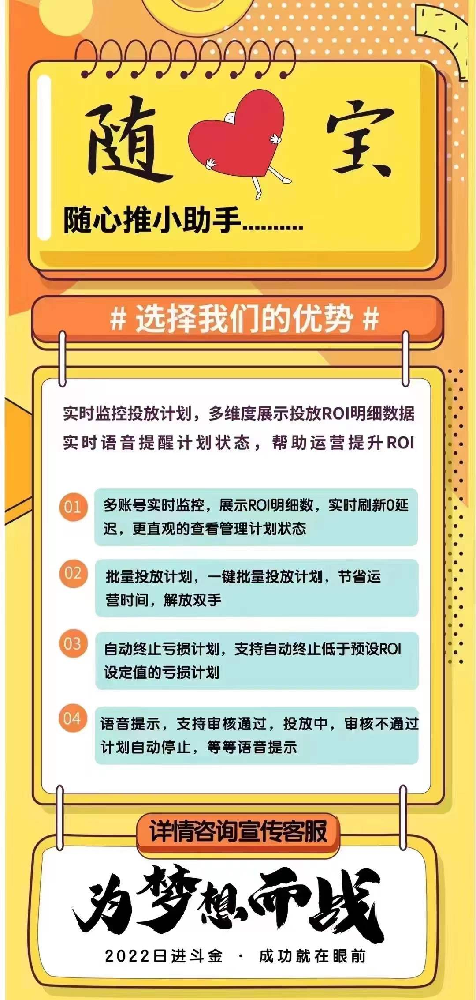

#  **随心宝-使用教程** 

---

免责声明：软件仅限个人学习研究使用，禁止使用平台提供的软件发布“刷单/返现/色情/赌博/洗钱/诈骗/”等等违反国家法律禁止的行为和信息，一旦发现即封停账号！其造成的后果与本软件无关！如有软件有侵犯你的权益，联系客服修改删除.

---

| 软件名称     | 版本号     | 下载地址     | 更新日期/说明    |
|----------|---------|----------|------------|
| 随心宝主程序   | 版本V2.95 | [随心宝下载](https://baoxi.lanzoub.com/iNd4s0odk9re)    | 111        |
| 一键环境部署   | 版本V2.63 | [一键环境部署下载](https://cowtransfer.com/s/4fe95335423b48) | 非新用户，不需要下载 |
| 微软环境运行库  | 无       | [微软运行库下载](https://cowtransfer.com/s/2d5c51a21ddd44)  | 333        |
| 一键关闭自带杀毒 | 无       | [一键关闭下载地址](https://wwt.lanzoub.com/iPUi505wpfgj) | 444        |

### 提交千川id,30天内消耗，当天订单数，当天停止数单个账号，请勿重复提交，请如实填写，否则出现未知后果，自行承担

##### 安装方法，如果不熟悉电脑的，请安默认安装设置，自动安装，不要修改路径以及其他的，如果安装失败，请检查电脑是否有D盘，很多朋友只有一个C盘，那是安装不成功的

##### 软件只限正常学习使用，如涉及违规行为，发现立即封停，有功能需求，BUG反馈，请在下发评论留言

---
> ### 宣传海报

---
> ### 获取体验卡
公众号: 奇客工作室（qikistudio）

