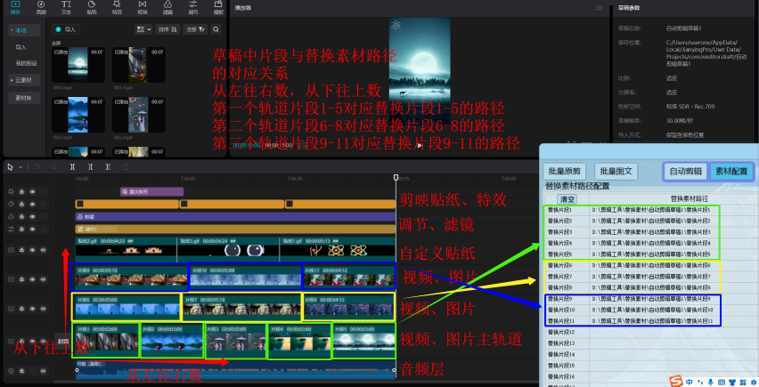

# **【多多快剪--图文+切片+混剪】**

---

免责声明：软件仅限个人学习研究使用，禁止使用平台提供的软件发布“刷单/返现/色情/赌博/洗钱/诈骗/”等等违反国家法律禁止的行为和信息，一旦发现即封停账号！其造成的后果与本软件无关！如有软件有侵犯你的权益，联系客服修改删除.

---

## **目录**

- 新增功能预告 

- 六大功能简述 ，

- 多多快剪海报 

- 多多快剪软件下载地址 

- [实操版] 四大功能制作演示 

- [完整版]每个功能详细教程

---

## 【新增功能预告】

- 8.11日 已新<mark>**增直播切**</mark>片功能使用演示在最底下07位置)

- 8月31 已新增<mark>**随机混剪**</mark>功能(使用演示在最底08位置9月中旬 
  
  即将开发AI智能配音洗稿功能

---
## 【六大功能简介】

1. **: 多多快剪--批量原剪**
   
   剪映做好去重草稿模板，可实现批变速，加画中画，贴纸GIF动画，翻转调色，加文字，加专场特效等，
      一键导入N个视频排队处理，<mark>**视频长度不同**</mark>，用同样去重手段批量输出去重剪辑的新视频.

2. **:多多快剪--批量混剪**
   
   剪映做好混剪模板，设置<mark>**多个分段**</mark>替换路径，软件自动按镜头分段替换混剪输出
   
   可指定某个分段<mark>**固定不变**</mark>，例如片头不变，后面分段自动替换混剪.

3. **:多多快剪--批量图文**
   
   同一批<mark>**图片或视频**</mark>导入，可导出<mark>**不同文字不同字体**</mark>的图片或视频
   
   <mark>**不同**</mark>的图片视频导入，可导出<mark>**相同**</mark>的文字，但字体颜色位置都<mark>**不同**</mark>

4. **:多多快剪--直播切片**
   
   直播视频内台词，按每一句话自动精准<mark>**分割镜头**</mark>，镜头可按时间自由导出视频
   
   自动分割后的镜头，按时间导出视频，可添加<mark>**指定或随机片头片尾**</mark>
   
   可按<mark>**关键词查找**</mark>，快速找到需要的镜头进行导出指定分段视频

5. **:多多快剪--音视混剪**
   
   所有镜头<mark>**打乱进行混剪**</mark>，可设置每个镜头使用的随机或指定秒数
   
   可按<mark>**音频长度**</mark>进行混剪，随机抽取素材进行合成输出，确保每个视频不重复
   
   打乱混剪输出的视频，可添加<mark>**指定或随机**</mark>片头片尾

6. :**多多快剪--批量工具**
   
   可单独使用的小工具，对视频<mark>**批量**</mark>进行高清转码，抽顿，变速，改分辨率，视频分割，打乱文件名等
   
   片段组合功能，是对文件夹内视频<mark>**自由组合**</mark>成新视频，换新音乐

---

---

### 多多快剪下载地址：

 https://pan.baidu.com/s/1orgQLrgeB5DWjL9A9Udp8Q?pwd=8888 提取码: 8888 

---

## [ [实操版]四大功能案例操作演示](https://docs.qq.com/doc/DVVl1WmxIVXdMcGxO)

1. : 单模板视频批量去重演示(从50秒--9分30秒) 

2. : 单模板视频混剪操作演示(从9分30秒--16分) 

3. : 多任务排队自动混剪设置(从16分--21分20秒) 

4. :固定分段其余分段自动换(从21分25秒--25分) 

5. : 图片视频批量加不同文字(从25分--33分30秒) 

6. : 内置各种小T具讲解演示 (从33分30秒--40分)

---

## [【完整版】软件使用教程](https://docs.qq.com/doc/DVVl1WmxIVXdMcGxO)

### 01.安装注册教程

##### 软件安装完成后添加安全中心排除项和杀毒软件信任

## 02-1.创作批量原剪草稿教程

## 02-2.批量原剪教程

## 03.批量图文教程

## 04-1.创作自动剪辑草稿教程

## 04-2.素材配置教程

## 【图解】草稿片段与替换素材路径对应关系

## 04-3.挂机排队多任务自动剪辑教程

## 05.批量工具教程

## 06.视频合成教程

## 07.直播切片教程

## 08.音视混剪