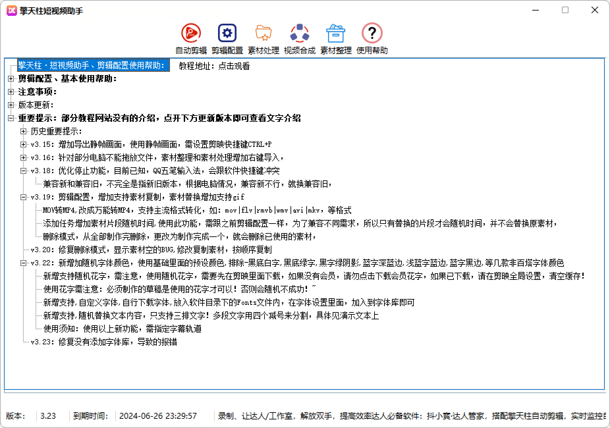

# 【剪映--擎天柱短视频助手】

---

免责声明：软件仅限个人学习研究使用，禁止使用平台提供的软件发布“刷单/返现/色情/赌博/洗钱/诈骗/”等等违反国家法律禁止的行为和信息，一旦发现即封停账号！其造成的后果与本软件无关！如有软件有侵犯你的权益，联系客服修改删除.

---

> ## 产品说明

### 擎天柱·短视频助手

- 擎天柱·短视频助手、可以帮助达人批量制作视频提升效率

- 短视频行业一定是内容为王，坚持制作原创视频持续输出本软件集成多个功能，

- 包含自动剪辑，素材分割，素材合成，素材裁剪，素材整理，等诸多功能于一身

- 我们立志于帮助每一个短视频工作室在致富的路上走的更远!

  ---
  
  
  
  ### 更新日志
  
  
  
> ## 软件下载

| 软件名称    | 版本号   | 下载地址                                             | 备注/说明      |
| ------- | ----- | ------------------------------------------------ | ---------- |
| 擎天柱批量剪辑 | V3.23 | [点击下载](https://baoxi.lanzoub.com/im7te1444e2f)   | 2023.7.2更新 |
| 一键关闭WD  |       | [关闭系统内置杀毒](https://wwt.lanzoub.com/iPUi505wpfgj) |            |

**2023.6.7日专业版和基础版合并: 

老用户习惯基础版可以使用基础版进行设置

部分教程为专业版演示，和基础版操作相差不大，

区别在于配置界面，基础版不区分轨道视频，专业版区分轨道视频
----
> ###视频教程

1、
<iframe src="https://cloud.video.taobao.com/play/u/22817274/p/1/d/fs/e/6/t/1/411804285681.mp4?auth_key=YXBwX2tleT04MDAwMDAwMTImYXV0aF9pbmZvPXsidGltZXN0YW1wRW5jcnlwdGVkIjoiNTE0YzEwNTE0YjU3Y2VlZTAxZGJmY2JkN2I1MzcyMWIifSZkdXJhdGlvbj0mdGltZXN0YW1wPTE2OTI3NjYzMTM=" 
 width="800" height="560"> 
</iframe>
2、单视频批量替换
<iframe src="https://cloud.video.taobao.com/play/u/22817274/p/1/d/fs/e/6/t/1/411799189634.mp4?auth_key=YXBwX2tleT04MDAwMDAwMTImYXV0aF9pbmZvPXsidGltZXN0YW1wRW5jcnlwdGVkIjoiNTE0YzEwNTE0YjU3Y2VlZTAxZGJmY2JkN2I1MzcyMWIifSZkdXJhdGlvbj0mdGltZXN0YW1wPTE2OTI3NjYzMTM="
 width="800" height="600">
 </iframe>
----

> ### 软件支持系统

#### **支持 win7、win8、win10、win11 系统**

----

> ## 公众号：QiKiStudio

