<head>
<style>
.video-container {
position: relative;
width: 100%;
padding-bottom: 56.25%; /* 16:9的宽高比*/
}
.video-container video {
position: absolute;
top:0;
left: 0;
width: 100%;
height:100%;
}
</style >
</head>

# 【9平台视频发布助手】

---

免责声明：软件仅限个人学习研究使用，禁止使用平台提供的软件发布“刷单/返现/色情/赌博/洗钱/诈骗/”等等违反国家法律禁止的行为和信息，一旦发现即封停账号！其造成的后果与本软件无关！如有软件有侵犯你的权益，联系客服修改删除.

---

## 软件简述：

- 软件仅支持windows系统。

- **软件不绑定电脑 任意换机使用，不限制使用账号数量。**

- 支持多种**定时**自动发布方案，支持挂车，

- **软件支持 抖音，快手，视频号，今日头条，西瓜视频，百家号，B站，小红书，小世界等平台视频发布**

- 请注意！抖音机构号可以使用，员工号暂不支持，

- 零售、批发、代理，可与多多快剪，擎天柱，视频制作7.0，剪辑师等各款批量剪辑混剪视频组合使用。

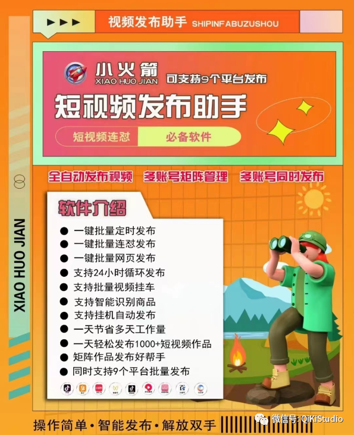

## 软件视频教程：[（点击观看）](https://docs.qq.com/doc/DSGJGYUlJdFRXekZX)

---

## **一、 软件使用教程：**

（建议点击右下角全屏观看）

#### 1.1 软件常规设置教程演示

<video  controls>
<source src="https://docs.qiki.asia/qikiclip/publish9PT.assets/1.1.mp4" type="video/mp4">
  Your browser does not support the video tag.
</video>

---

#### 1.2 四种定时发布方案设置讲解
- 第一段讲解  1.立即发布 2.网页定时发布 3.文件夹监控发布  4.软件发布 四种发布方式区别
- 第二段讲解  单账号发布设置
- 第三段讲解 多账号常见发布方案 和设置思路.

<video controls>
  <source src="https://docs.qiki.asia/qikiclip/publish9PT.assets/1.2.mp4" type="video/mp4">
  Your browser does not support the video tag.
</video>

---

#### 1.3 宽带拨号换IP讲解+演示
可以实现每个号发布的视频ip都不同，需电脑直连ADSL猫进行自动拨号，
例如你在上海市，则你每个号发布是不同的上海ip地址

<video  controls>
  <source src="https://docs.qiki.asia/qikiclip/publish9PT.assets/1.3.mp4" type="video/mp4">
  Your browser does not support the video tag.
</video>

---

#### 1.4  接入代理IP使用设置讲解
可实现不同号不同省份IP，例如A账号用深圳的IP发布，B账号用天津IP发布
可实现不同号同一省份ip，例如你在上海，所有号使用南京ip发布
 
<a href="https://h.shenlongip.com/index?from=seller&did=ONtK53">👉代理ip注册购买网址👈</a>

<video  controls>
  <source src="https://docs.qiki.asia/qikiclip/publish9PT.assets/1.4.mp4" type="video/mp4">
  Your browser does not support the video tag.
</video>

---

##  **二、 软件下载地址**

| [<mark>蓝奏云</mark>](https://ww0.lanzoul.com/b00y6f7ib) 密码:8pgx | [ <mark>毒盘</mark> ](https://pan.baidu.com/s/1IAWAAGXJSgovpD2-1p2Ycg?pwd=6qkw) 提取码: 6qkw |
| -------------------------------------------------------------- | ------------------------------------------------------------------------------------- |

###### (下载选择编号:<mark>004小火箭9平台视频发布助手</mark>)

---

## <mark>三、 【**必装**】微软Ed浏览器：</mark>

#### 4.1 电脑需要 有edeg浏览器，win10和win11系统一般都自带：

<mark>软件能正常使用，下面这些就不需要下载安装了。</mark>

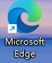

###### 【[**<mark>去官方Edge下载</mark>**](https://www.microsoft.com/zh-cn/edge/download?form=MA13FJ)】win7或者没有安装系统自带的edge浏览器，请点击到官方下载

下载地址： [下载 Microsoft Edge](https://www.microsoft.com/zh-cn/edge/download?form=MA13FJ)

如已经安装过Edge浏览器，还是不正常，提示错误英文，或登录不了账号，下载插件安装即可

#### 4.2 [**<mark>必备Eegd浏览器插件</mark>**]()

如系统自带安装了Edge浏览器，打开提示下面这个错误提示，是因为系统是阉割精简版，需要安装这个插件

| 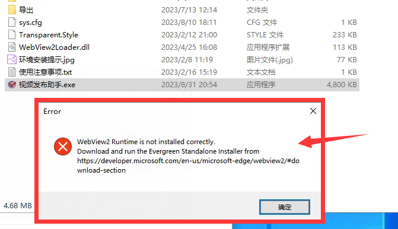 | 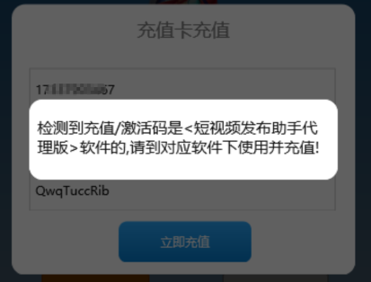 |
| ----------------------------------------- | -------------------------------------- |

【出现上面2个问题，点击下载安装浏览器插件即可】

[毒  -  盘]( https://pan.baidu.com/s/1DRY0uYfnpjDfqKYr2wAWzg?pwd=9hnr) 提取码: 9hnr

---

##  **四、发布失败常见问题总结:**

1. <mark> 软件和素材</mark>不要放在C盘或者桌面，请解压放在其它D盘E盘F等任意盘<mark>文件夹</mark>内

2. 软件用<mark>右键管理员身份</mark>运行，否则会因软件权限不够原因引起不能正常发布

3. win7系统不显示登录账号<mark>界面白屏或者错误</mark>，点击下面Edge浏览器和插件安装后重新启动电脑.

4. 发布的视频格式为<mark>MP4格式</mark>文件，无法自动发布<mark>MOV</mark>等其它类型文件，

5. 至少要<mark>添加一个话题</mark>，否则会引起发布失败

6. 如需要<mark>随机描述</mark>，请用txt文本<mark>一行一个</mark>排列写好，并且txt格式为UTF-8 (如下图)，

7. 发布的文件夹内视频数量过多，会引起检测失败，可先<mark>减少视频数量</mark>发布是否正常能发布，软件有防重复发送检测机制，发布<mark>提示没有文件</mark>，请修改素材文件夹名或者视频名称，或者把要发布的视频复制多份不同文件名的视频，即可实现单个视频多次发送.

8. 设置参数之后，一定记得点击<mark>设置保存</mark>，否则后修改的设置无效

9. <mark>视频号</mark>发布时候，有个短标题，不能有<mark>特殊符号</mark>，否则容易发布失败

10. <mark>百家号</mark>发布，部分电脑会遇到白屏卡住无法上传，给软件<mark>加个执行保护</mark>，电脑分辨率使用常规推荐的分辨率。
    
    软件加执行保护教程：  
    [win10数据执行保护怎么设置 win10数据执行保护在哪里设置](https://www.xtzjup.com/help/246702.html)

---

#### 4.1 软件充值续费，如何填写客服发给你的激活码？

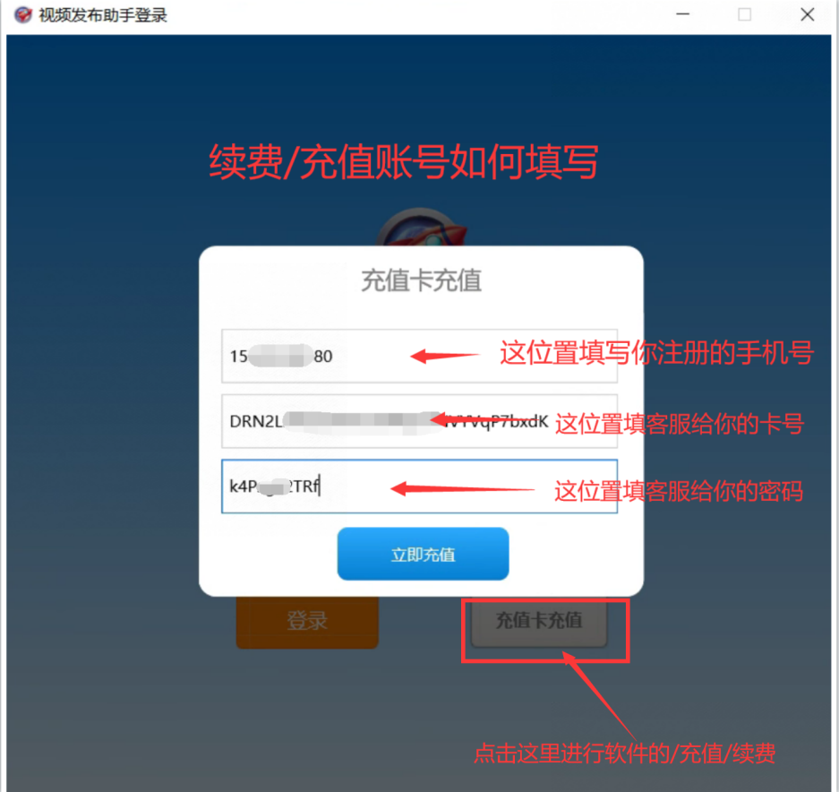

#### 4.2 遇到有的号发布正常，有的号发布不正常，处理步骤：

 先确定这个发布有问题账号登录正常，设置是否正常，检查后都正常   把文件目录里面cache文件夹都删除了，重新启动软件，再进行发布.

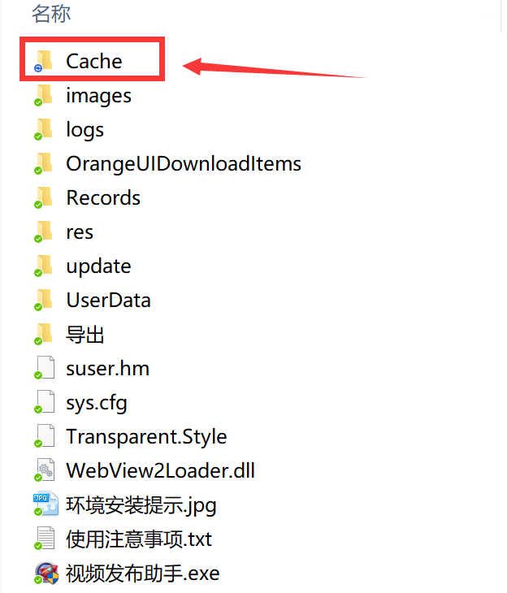

#### 4.3 如遇到特殊无法处理的问题，把软件根目录内日志文件夹，打开发给客服.

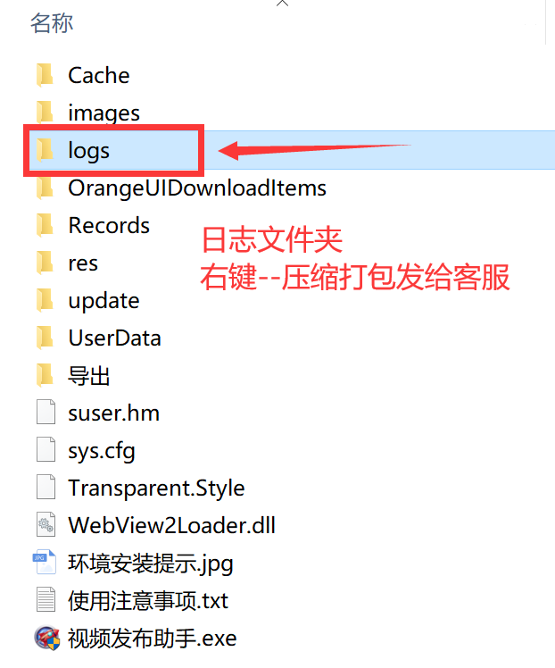

#### 4.4 随机标题格式和设置：

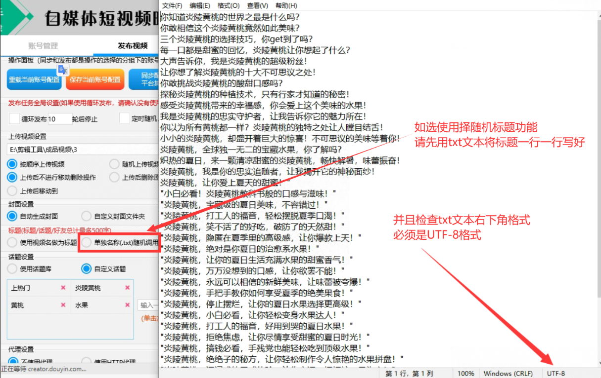

#### 4.5 <mark>**商品挂车**</mark>

<mark>抖音</mark>挂车地址，增加的是登录网页端巨量后台，商品的长链接复制到软件内。

<mark>快手</mark>增加的是商品名称。先用网页端增加一个商品，就知道这个名称是什么，商品名字填写到软件内就可以了。

#### 4.6 添加地址或团购地址

软件添加本地地址之前，需要先到网页端可搜索需要添加地址的名称，填写到软件内即可

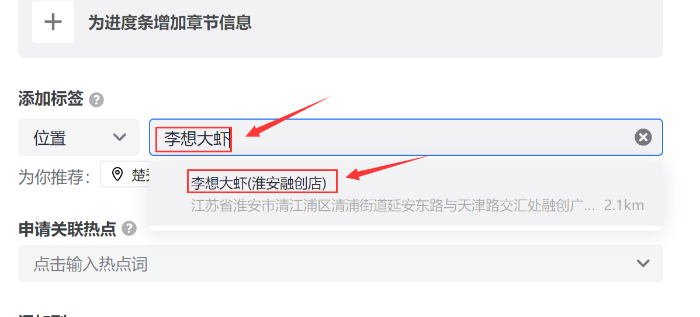

如果添加的全国性的异地地址，需要账号有国内地址搜索权限，

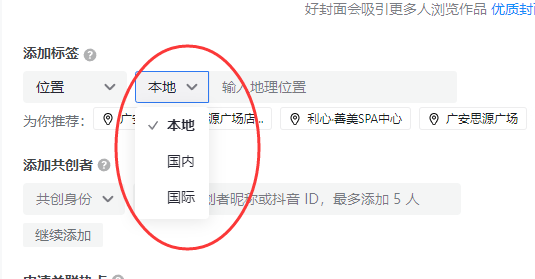

像下图这种没有国内搜索权限的号，需要电脑使用代理IP跳过去，能搜索到异地地址才可以添加到软件内

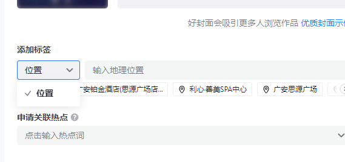

---

### **五、 软件截图：**

### **登录界面：**

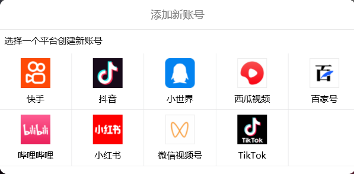

### 抖音发布界面

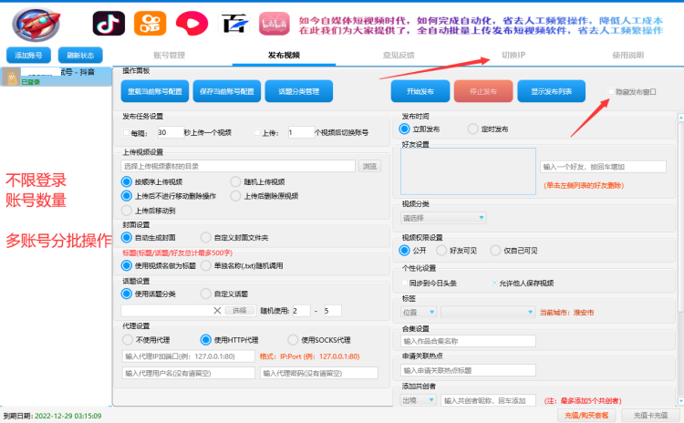

### 快手发布

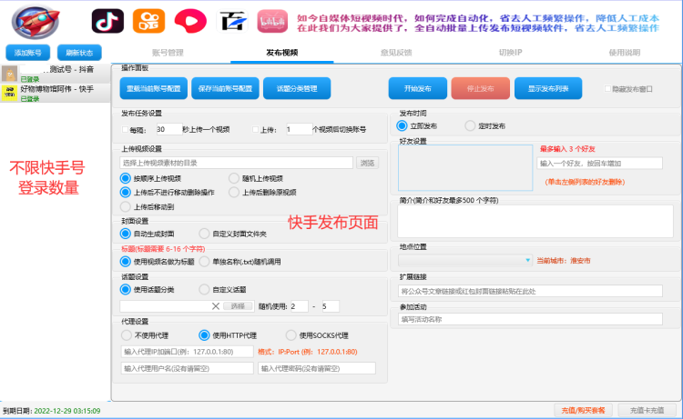

### 视频号发布

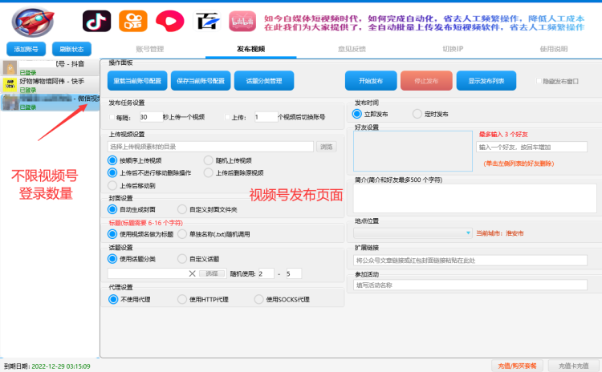

> ## 联系我们

| 公众号                          | 微 信                         |
|:----------------------------:|:---------------------------:|
|  |  |