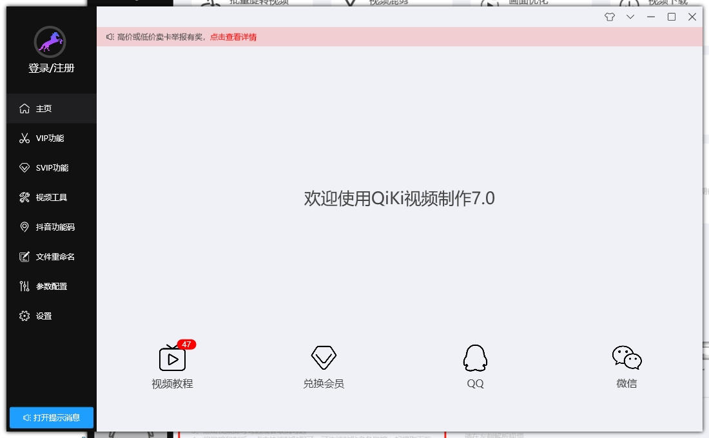
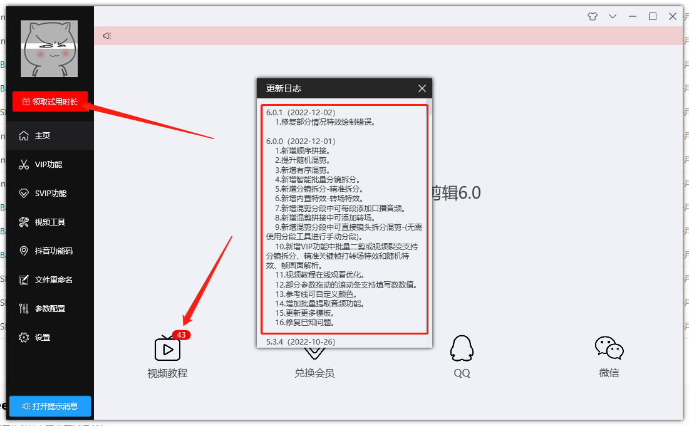
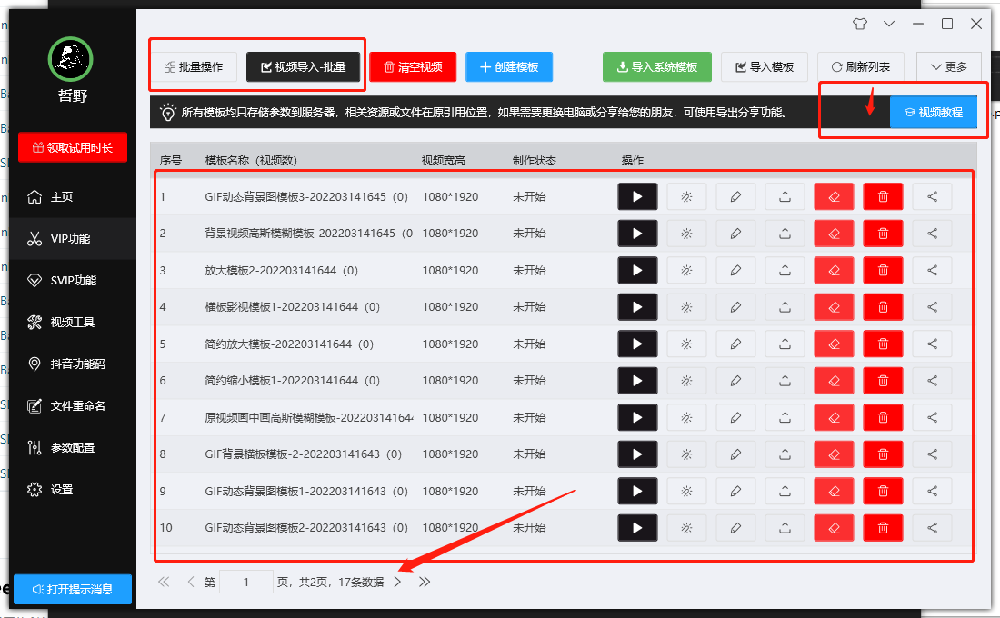
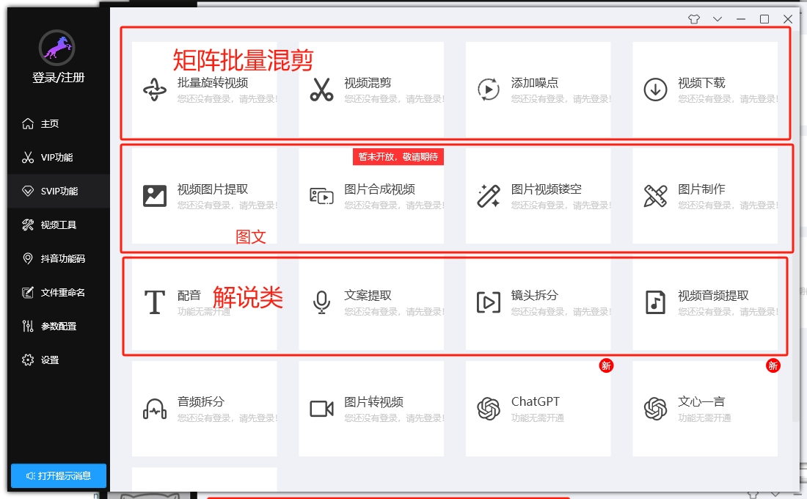
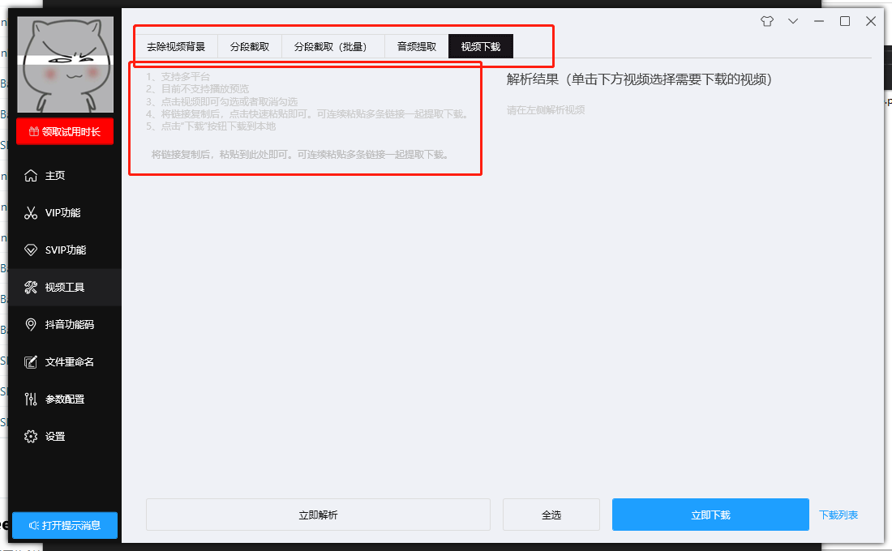
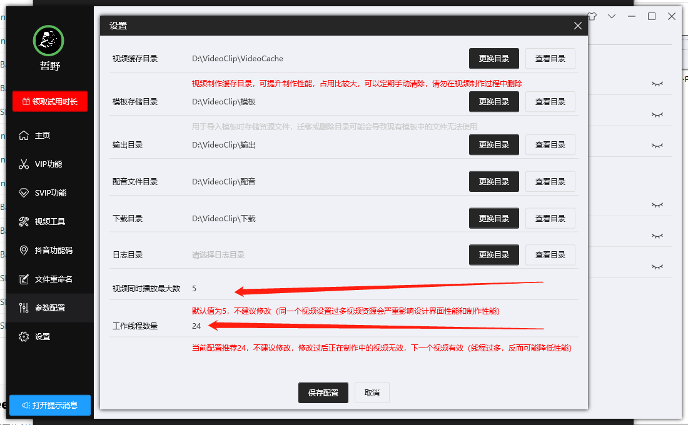
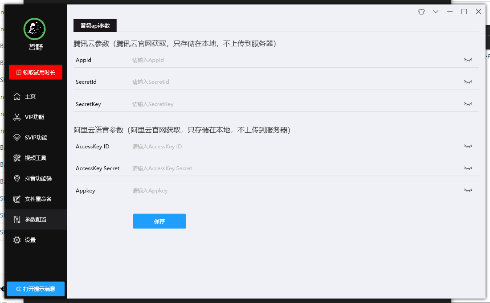

> # 软件介绍

---

免责声明：软件仅限个人学习研究使用，禁止使用平台提供的软件发布“刷单/返现/色情/赌博/洗钱/诈骗/”等等违反国家法律禁止的行为和信息，一旦发现即封停账号！其造成的后果与本软件无关！如有软件有侵犯你的权益，联系客服修改删除.

---

### 视频制作7.0 是一款全自动的视频剪辑软件

包含<mark>剪辑，合成，去重，特效，配音，字幕，水印，后期处理，自动生成片头等等</mark>功能，

可以用于<mark>视频搬运，给视频增加特效，图片合成视频，视频混剪，自动加配音字幕，电影解说，抖音混剪</mark>等等​。一个软件就堪比一个视频剪辑团队，即便你是小白，也能轻松上手，视频制作7.0让你的视频剪辑效率提高千百倍​,而且不费劲。

> 举例：

* 多个视频多个文案批量生成影视解说
* 图片批量合成视频+多个文案生成原创视频
* 多个视频片段随机合成+多个文案生成原创视频
* 单个视频+抠像+替换多个背景+多个文案生成原创视频
* 视频几十种去重方法+二剪生成原创视频
* srt精准配音，实现画面，字幕，与声音精准匹配
* 27种配音模式，实现任意形式的配音字幕组合，双语字幕，配音翻译等等
* 视频多种水印让自己的原创视频防止盗窃
* 视频各种批量剪辑操作，帧率,变速，压缩，倒放，镜像，画中画，gif，过度，音乐，片头片尾... 

----
> ### 下载
 
 [软件下载](https://qkcm.lanzouy.com/b011bjb6f) 密码:7ld4

----

> ### 软件界面预览

界面区域

----
> ### 软件教程
 下载安装后 即可查看全部视频教程
[点击查看](qikiclip/qikiclip6_0?id=下载)

----

> ### 公众号: 奇客工作室（qikistudio）
 
 