# 软件介绍

QiKi剪辑师是一款全自动的视频剪辑软件，包含剪辑，合成，去重，特效，配音，字幕，水印，后期处理，自动生成片头等等功能，可以用于视频搬运，给视频增加特效，图片合成视频，视频混剪，自动加配音字幕，电影解说，抖音混剪等等​。一个软件就堪比一个视频剪辑团队，即便你是小白，也能轻松上手，QiKi剪辑师让你的视频剪辑效率提高千百倍​,而且不费劲。

举例：

* 多个视频多个文案批量生成影视解说
* 图片批量合成视频+多个文案生成原创视频
* 多个视频片段随机合成+多个文案生成原创视频
* 单个视频+抠像+替换多个背景+多个文案生成原创视频
* 视频几十种去重方法+二剪生成原创视频
* srt精准配音，实现画面，字幕，与声音精准匹配
* 27种配音模式，实现任意形式的配音字幕组合，双语字幕，配音翻译等等
* 视频多种水印让自己的原创视频防止盗窃
* 视频各种批量剪辑操作，帧率,变速，压缩，倒放，镜像，画中画，gif，过度，音乐，片头片尾... 
* ...

这个一款跨平台的软件，支持win32 win64和mac，也能支持liunx 所有操作都支持批量，并且具有的不同的效果，比如每个视频可以有不同的特效，不同的背景，不同的字幕，不同的水印，不同的音乐，不同的片头片尾等等，软件专为批量而生。

----

# 软件支持系统

**支持MAC 和 Windows系统**

----

# 软件界面预览

界面区域
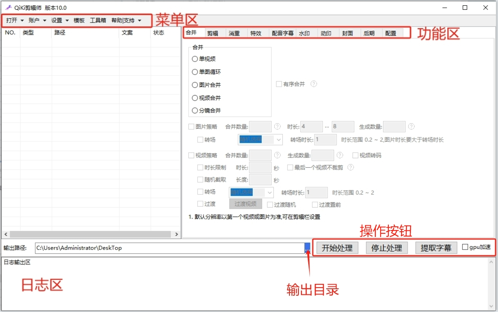

打开文件
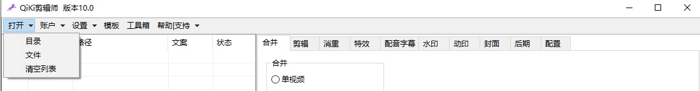

账户信息
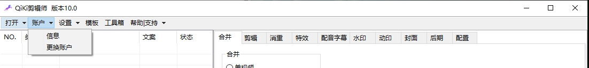

设置
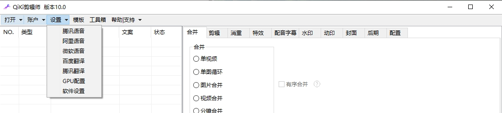

模板
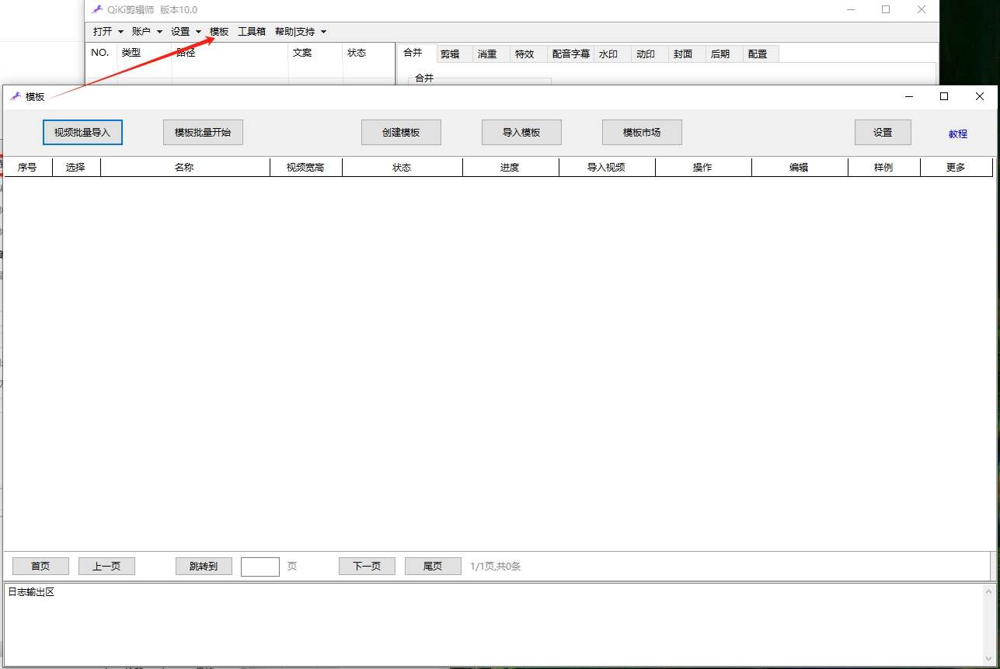

工具箱
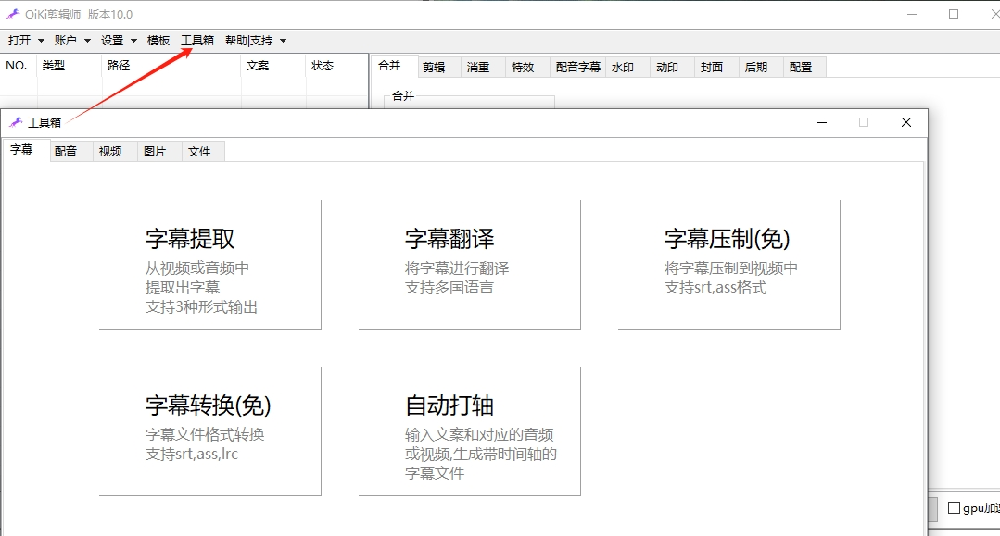

帮助支持
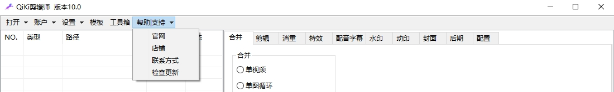
> ### 功能区

合并
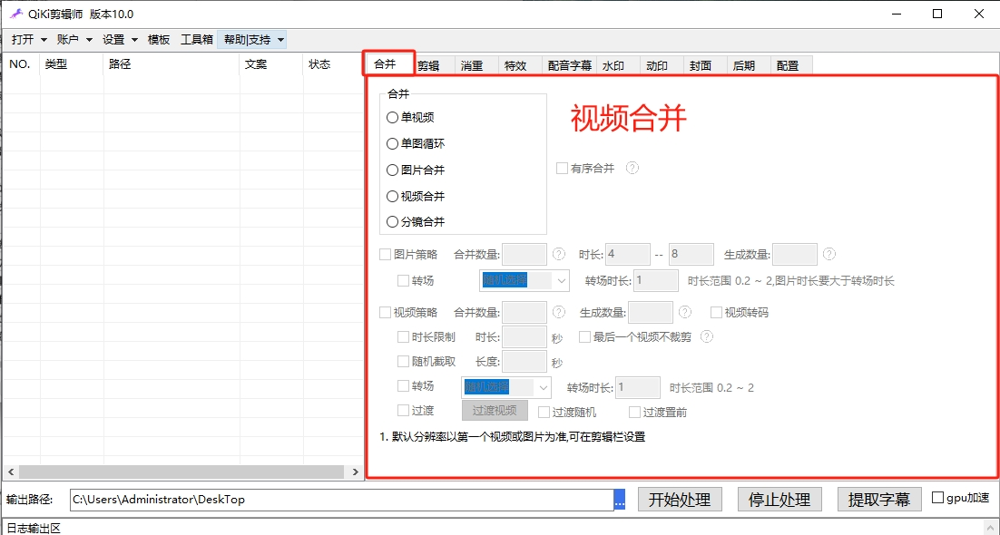

剪辑
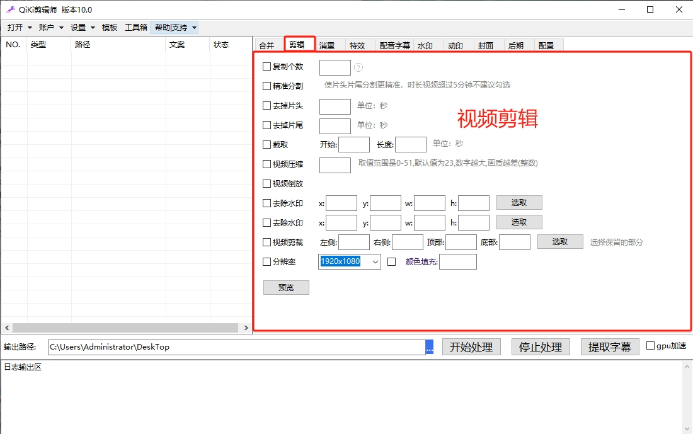

消重
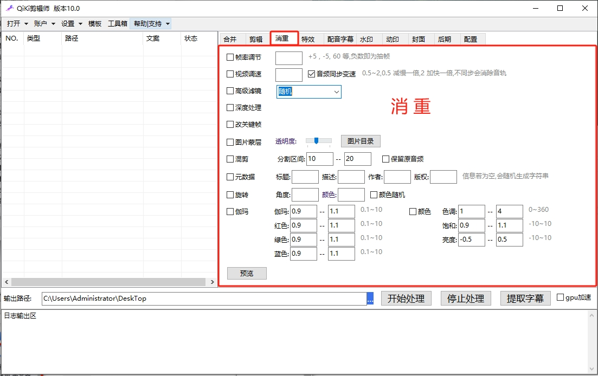

特效
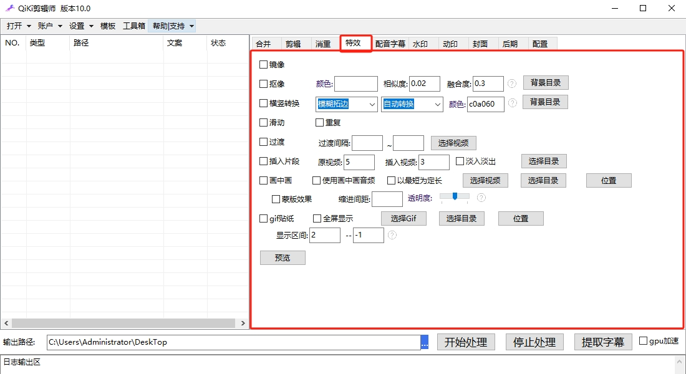

配音字幕
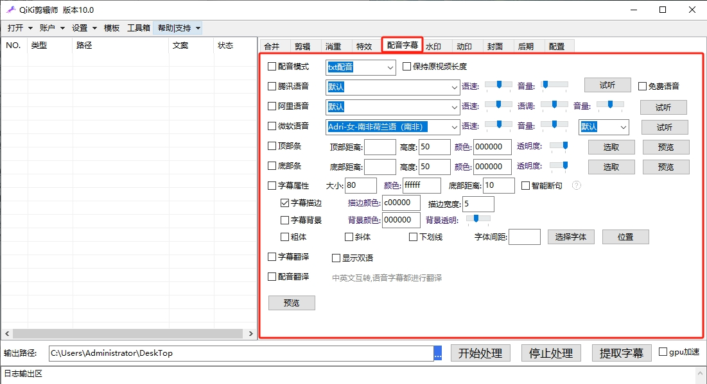

字幕修改
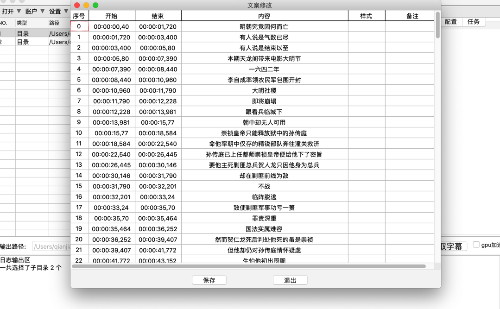

水印功能
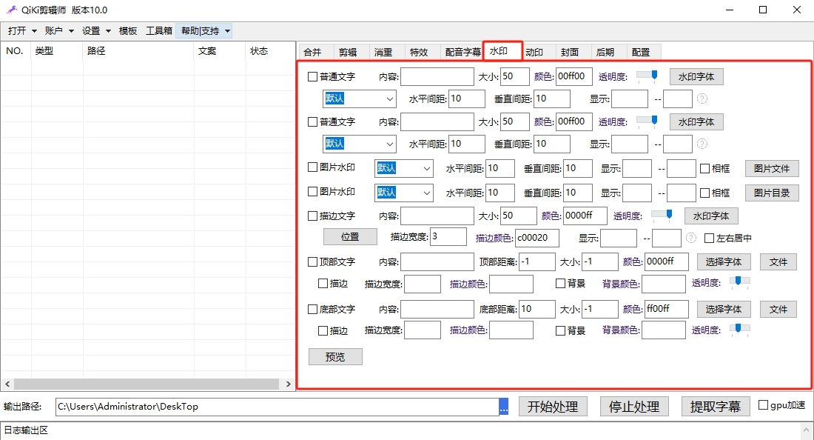

动态水印
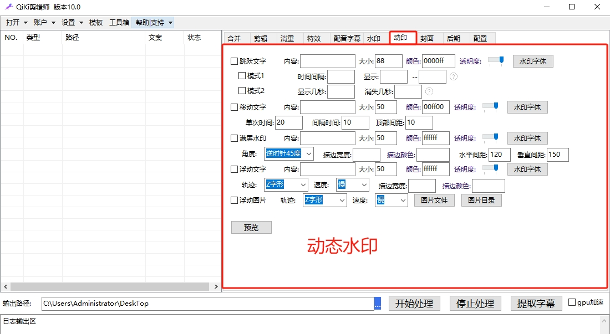

封面
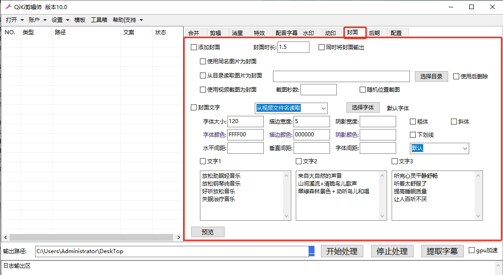

后期
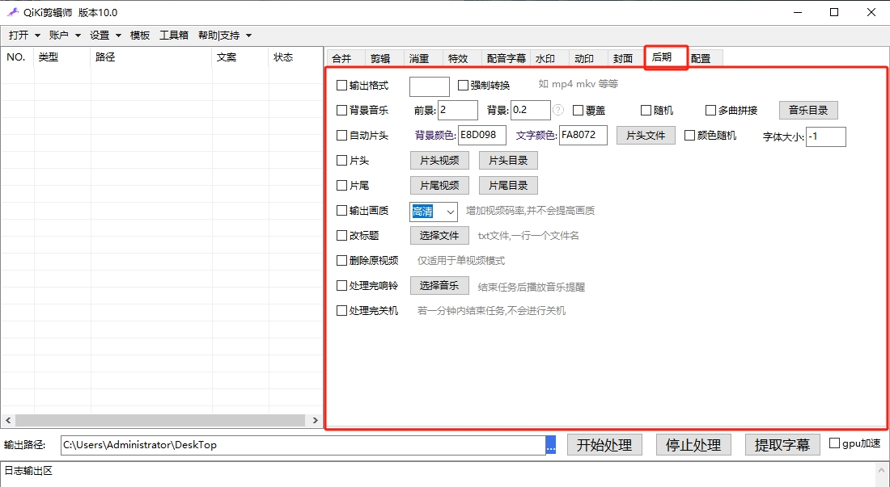

配置
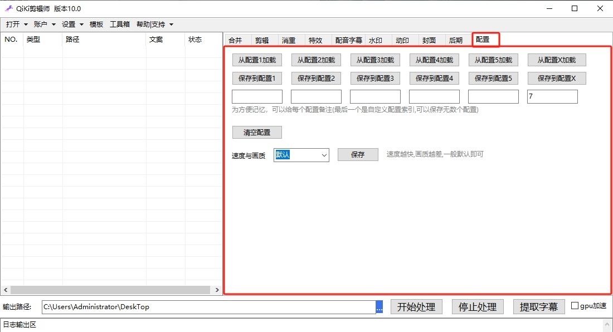
----

> ### [软件教程]()-更新中······

----

> # 联系我们

| 公众号                          | 微 信                         |
|:----------------------------:|:---------------------------:|
|  |  |