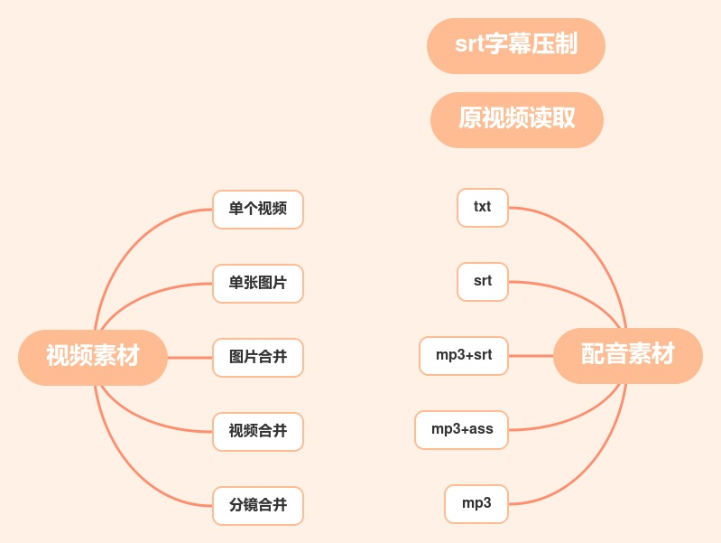

## 配音模式

## 教程

5*5 + 2 = 27  一共有27种配音模式，srt 字幕压制和从原视频读取只能用于单个视频模式。txt 和srt素材可以从视频或者音频中提取

**必看** [27种配音模式及参数讲解](https://www.qikistudio.com/)

[自动换行与手动换行详解](https://www.qikistudio.com/)

### 单视频模式

* 单视频+txt 批量配音，支持双语 [视频演示](https://www.qikistudio.com/) [视频翻译成任意国家语言](https://www.qikistudio.com/)
* 单视频+srt 批量配音 ，解说搬运 [视频演示](https://www.qikistudio.com/)
* 单视频+mp3 批量配音，口播配音或者是加音乐
* 单视频+mp3+srt 批量配音，口播配音+字幕
* 单视频+从原视频读取批量配音，批量配音去重
* 单视频+字幕压制批量操作，批量自动加字幕 [视频演示](https://www.qikistudio.com/)  [加字幕设置单语双语](https://www.qikistudio.com/)
* 单视频批量翻译，中英文互转 [视频演示](https://www.qikistudio.com/)

### 单图模式

* 单图+txt 批量配音，故事会 [视频演示](https://www.qikistudio.com/)
* 单图+mp3+srt 批量配音，故事会 [视频演示](https://www.qikistudio.com/)

### 多图模式

* 多图+txt 批量配音
* 多图+mp3 批量配音，相册模式
* 多图+mp3+srt 批量配音，娱乐解说

### 多视频模式

* 多视频+txt 批量配音，[中视频](https://www.qikistudio.com/)    [字幕自动换行](https://www.qikistudio.com/)
* 多视频+mp3/srt 批量配音  [视频演示](https://www.qikistudio.com/)  用于自己录音或者使用第三方配音的情况  
* 批量解说案例

### 分镜模式

* 分镜+txt 批量配音

### 案例

配音和字幕是独立的，可以只加配音不加字幕，也可以只加字幕不加配音

* [单视频+横竖转换+bgm(视频为定长)](https://www.qikistudio.com/)
* [单视频+横竖转换+配音MP3(音频为定长)](https://www.qikistudio.com/)
* [自动加字幕和双语字幕](https://www.qikistudio.com/)
* [中英文视频互转](https://www.qikistudio.com/)
* [影视解说搬运](https://www.qikistudio.com/)(影视解说搬运，画面，声音，字幕完全同步)
* [中视频计划-批量制作原创解说](https://www.qikistudio.com/)

[全自动配音加字幕(txt配音)](https://www.qikistudio.com/)

[配音翻译](https://www.qikistudio.com/)

[文案自动翻译后再进行配音加字幕](https://www.qikistudio.com/)

[中文视频自动转为英文视频-这个功能需要年卡](https://www.qikistudio.com/)--如果是其他语言，则自动转为中文

[从零到一影视解说教程](https://www.qikistudio.com/)

[无文案配音](https://www.qikistudio.com/)

[批量配音加字幕](https://www.qikistudio.com/) 

[自备音频和字幕](https://www.qikistudio.com/)

部分教程用AI配音大师录制，操作的方法没有任何区别

单视频配音时，如果原视频有水印或者字幕，水印可以用剪辑栏的去水印功能，字幕可以用剪辑栏剪裁的方式，或者字幕栏的遮盖功能。视频文件名需要和文案的文件名一一对应。
* [单视频+txt批量配音](https://www.qikistudio.com/)

视频多个片段合并，然后和每个txt文案合成视频，每个视频的内容都不同。
* [多视频合并+txt批量配音](https://www.qikistudio.com/)

> 批量配音详细步骤

1. 准备视频
2. 提取文案
3. 按目录放好素材
4. 如果需要配音和画面匹配，去掉片头没有配音的部分
5. 选择配音员，原字幕处理(3种方式)，添加新字幕,填完参数可以预览效果
6. 添加自己的水印，片头片尾，背景音乐等

