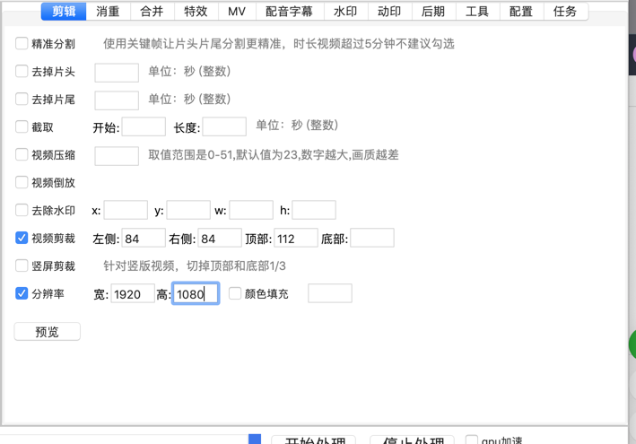
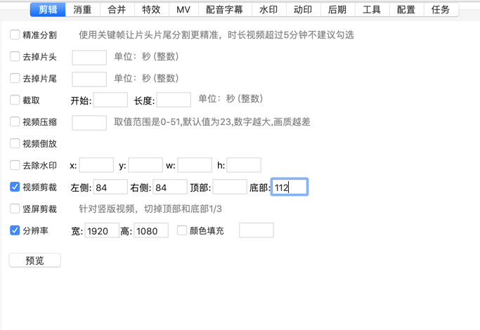
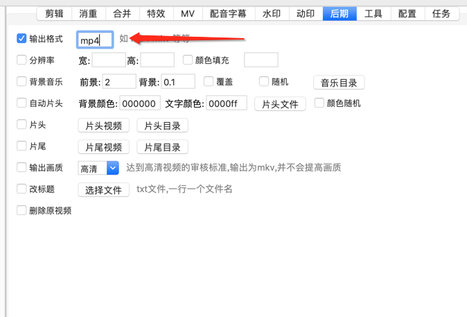

## 剪辑栏

[去片头片尾](https://www.qikistudio.top)

[截取](https://www.qikistudio.top)

[压缩](https://www.qikistudio.top)

[视频倒放](https://www.qikistudio.top)

[去水印](https://www.qikistudio.top)

[视频剪裁](https://www.qikistudio.top)

[分辨率](https://www.qikistudio.top)

## 如何完美去b站水印案例（以横版举例）

#### 如果水印在上方

#### 如果水印在下方

因为b站的视频flv 格式，最好同时转换一下格式

