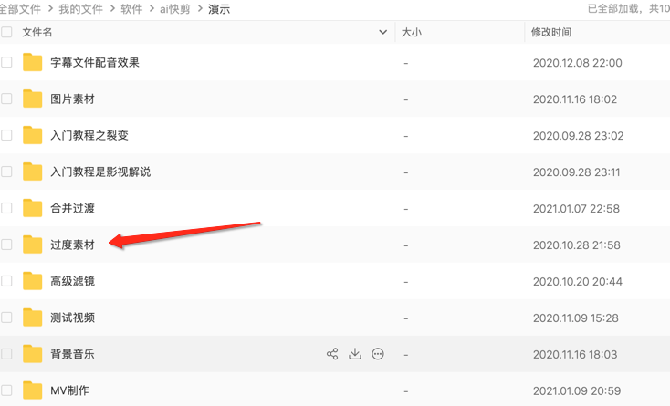

## 特效栏

[抠像](https://www.qikistudio.top)  [抠像2](https://www.qikistudio.top)

`相似度 [0.01 - 1]`
`融合度 [0 - 1]` 
相似度 取值范围 [0.01 - 1] 意思是“差不多”的像素也会被抠掉，数值越小，颜色匹配时越严格，极端情况下比如取值为0.01就是只抠除第一个参数指定颜色的像素
融合度比例 [0 - 1]，视频和背景融合的程度

[横竖转换](https://www.qikistudio.top)

横竖转换说明
1. 7种横竖转换默认都会进行横竖屏转换，如果选择了 `左右`或者`上下`，必须填间距
2. 其中模糊拓边，背景颜色，背景图片，背景视频支持间距调整，也就是前面4种支持方向选择
3. 如果自定义间距，模糊拓边的间距在原视频内，其余3种的间距在视频外

[过渡](https://www.qikistudio.top)

这个过渡视频教程用的就是一道亮光特效，素材在百度网盘，如果用自己的特效，注意只能是mov 或者avi 格式，并且背景是透明的。

[画中画](https://www.qikistudio.top)

1. 画中画
	1. 自身
	2. 选择视频（需要提前缩小视频）
	3. 选择目录（需要提前缩小视频）
2. 蒙版
	1. 自身
	2. 选择视频
	3. 选择目录

[gif特效](https://www.qikistudio.top)

支持4种显示区间类型

* 0到5秒   `0 ~ 5`
* 5到10秒  `5 ~ 10`
* 5秒之后   `5 ~ -1`
* 最后3秒   `0 ~ -3`
