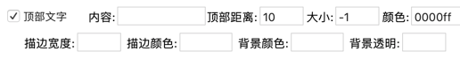
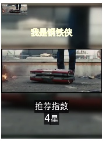
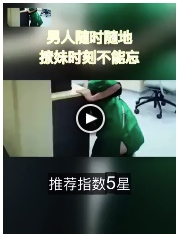
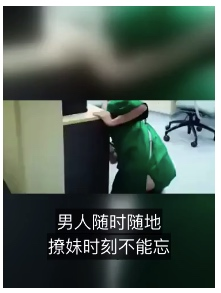
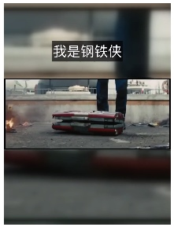

> 水印显示区间

支持4种区间类型

* 0到5秒   `0 ~ 5`
* 5到10秒  `5 ~ 10`
* 5秒之后   `5 ~ -1`
* 最后3秒   `0 ~ -3`

> 关于水印字体的选择

部分水印支持使用外部字体，如ttc，ttf 等，如果显示为方框，这里有两种情况

1. 这个字体不支持这种语言，大多数字体只能支持中文或者是英文
2. 这个字体无法使用

?> 最简单的测试方法，水印内容输入 ` abc中国`, 如果全部显示，说明支持中英文，如果只显示`abc`说明只支持英文，如果只显示`中国`说明只支持中文

----

[文字水印](https://www.qikistudio.com/)

[图片水印](https://www.qikistudio.com/)

[描边文字](https://www.qikistudio.com/)

[顶部文字和底部文字](https://www.qikistudio.com/)

[跳跃文字](https://www.qikistudio.com/)

[移动文字](https://www.qikistudio.com/)

[防伪防盗水印](https://www.qikistudio.com/)

[浮动文字](https://www.qikistudio.com/)

[浮动图片](https://www.qikistudio.com/)

## 顶部文字和底部文字的说明(对于批量操作，此项非常重要，仔细阅读)

>注意：
1. 文字描边效果和背景效果只能二选一 
2. 文字中`-`即换行，可以通过多个`-`实现多行效果
3. 配音也支持此操作，比如txt配音，会读取txt的文件名，srt，会读取srt的文件名，依次类推

这是文字水印也是专门为了批量化定制的，如上图所示，如果写了内容，那么所有视频上显示的文字都是一样的，这显然不是我们想要的效果(如果你想要所有视频显示一样的文字，那么内容里面填文字即可)。那么这里采用了读取文件名的方式。文件名以下划线`_`分割成顶部文字和底部文字，然后以空格表示换行。使用文件名作为内容的时候，内容框内需要为空。

简单点解释就是，**下划线`_`前面为顶部文字，后面为底部文字，中划线`-`代表换行。**

举例说明：

#### 实现 顶部一行文字 底部两行文字
文件名 `我是钢铁侠_推荐指数-4星.mp4`

#### 实现 顶部两行文字 底部一行文字
文件名 `男人随时随地-撩妹时刻不能忘_推荐指数5星.mp4`

#### 实现 顶部没有文字 底部两行文字
文件名 `_男人随时随地-撩妹时刻不能忘.mp4`

#### 实现 顶部一行文字 底部没有文字
文件名 `我是钢铁侠.mp4`

以此类推没有文字，1行，2行，3行，4行...的效果。所以你要实现每个视频添加不同的文字和不同文字效果的时候，提前编辑好视频的文件名即可。

距离参数说明：顶部文字的距离是指距顶部的距离，底部文字的距离是指距底部的距离，填`-1`则由软件自动计算距离。

