### 软件介绍

QIKI裂变是一款全自动的视频剪辑软件，包含合并，剪辑，合成，去重，特效，水印，后期处理等功能，核心功能是 **合并** 和 **裂变**。

> 支持各种模式的合并，比如：

1. 选取n张图片，每次随机取m张，随机x次
2. 选取n个视频，每次随机取m张，随机x次，支持对每个视频先进行截取再合并，并且支持添加转场或者过渡，比如放入50个视频，每次5个合并，输出几千个不重复的视频
3. 选取n张图片，选取m个视频，图片和视频混合随机合并
4. 分镜合并，每个镜头的视频放入一个目录，支持从每个镜头中选取n个视频，随机m次，同时支持转场或者过渡，用来制作盘点也很方便。

> 裂变：将1个视频裂变成无数个不重复的视频

这个一款跨平台的软件，支持<mark>win32 win64和mac</mark>，非常适合批量剪辑视频。

----

### 软件支持系统

**支持MAC 和 Windows系统**

----

> ## 二：安装包下载地址

| 毒盘   | 密码   | 蓝奏云                                        | 密码   |
|------|------|--------------------------------------------|------|
| [👉点此下载👈](https://pan.baidu.com/s/1wIVgNtGp3MnqqB7bNe-H8A?pwd=qqx2) | qqx2 | [不可用]() | ```` |

<p style="color: #ff0000; font-size: 24px;">软件有自动更新升级，如果失败，请下载最新安装包</p>

----

### 软件界面预览

合并区
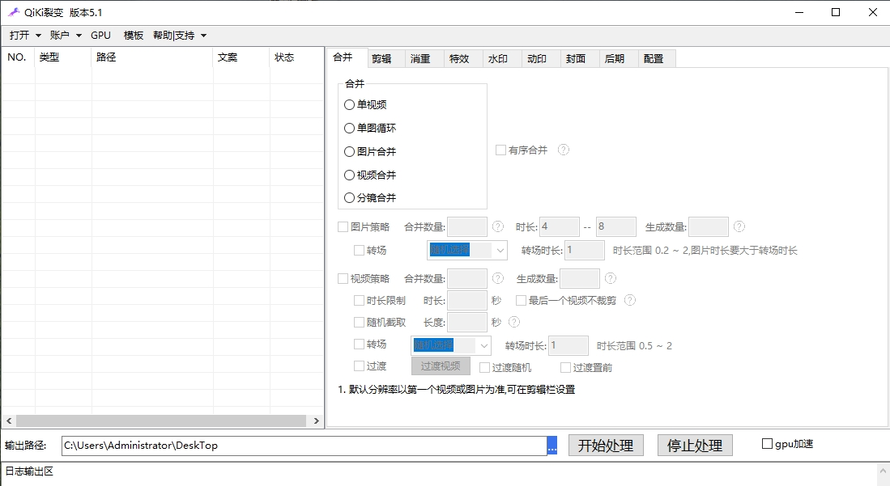

剪辑
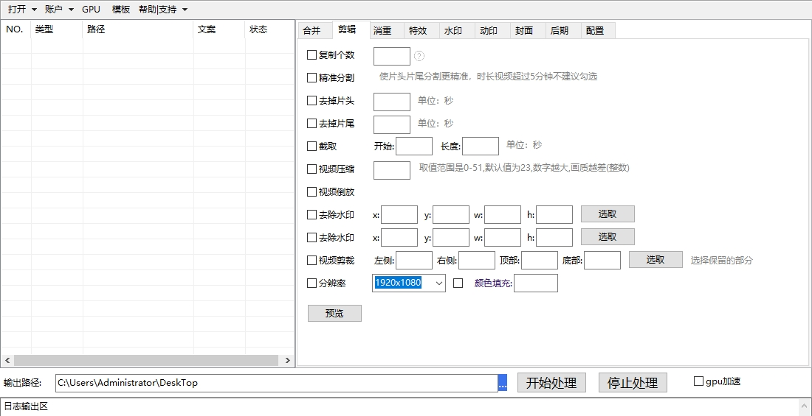

消重
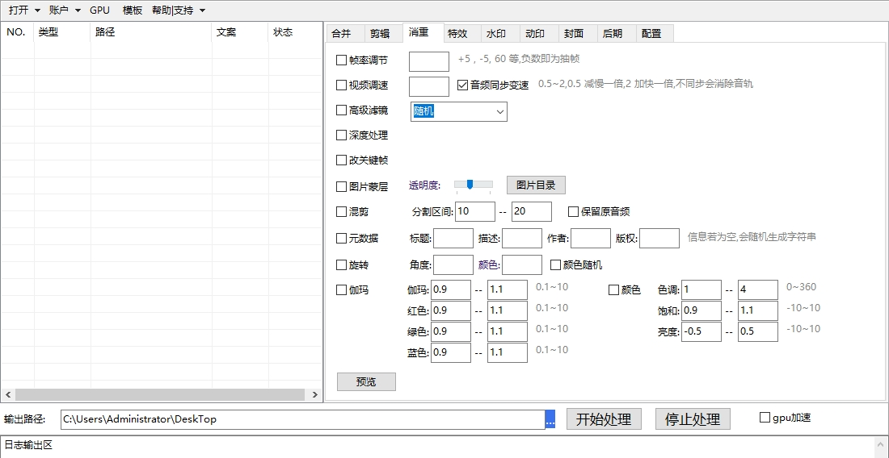
特效
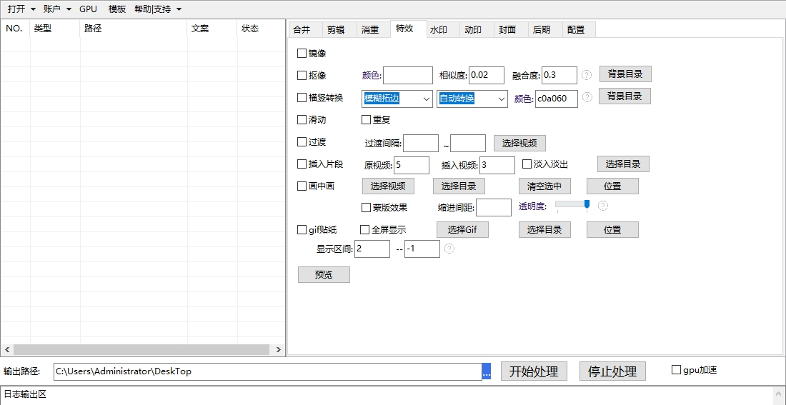
水印
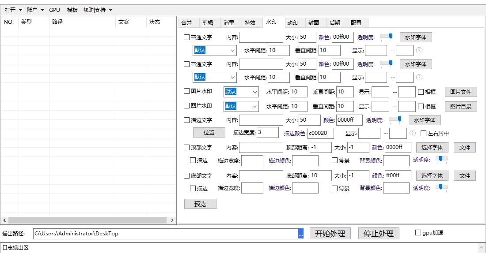
动态水印
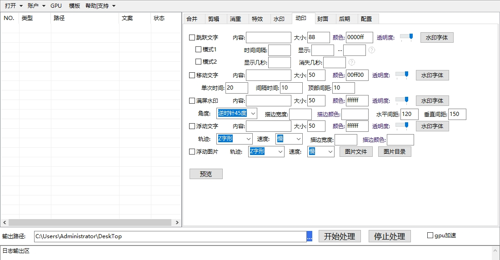
封面
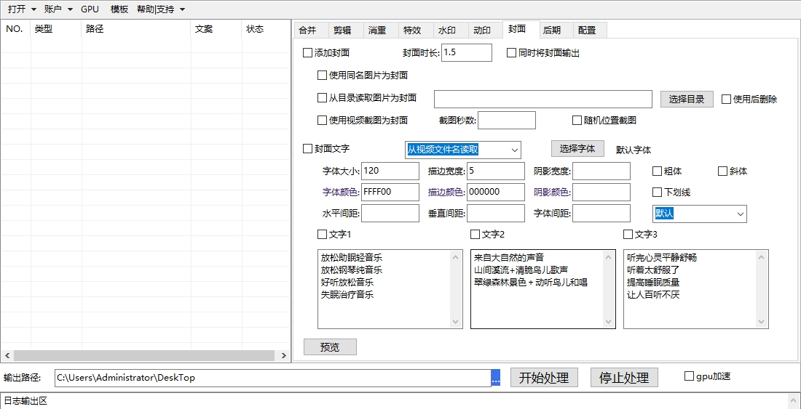
后期
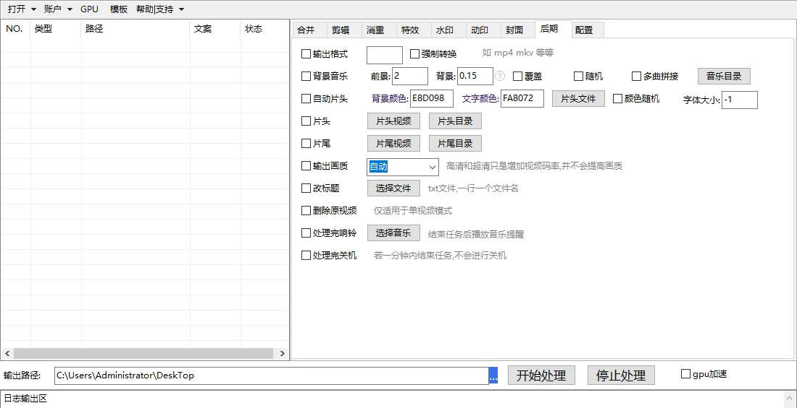
配置
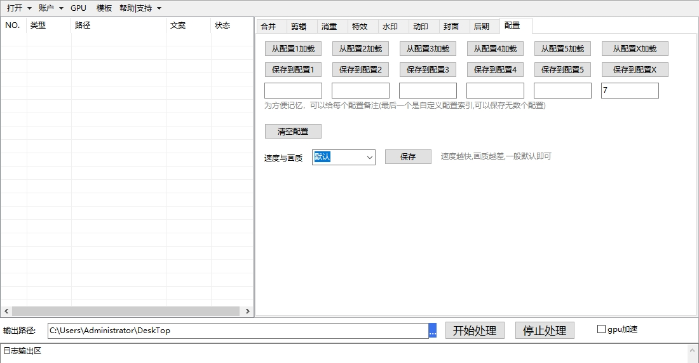

模板功能
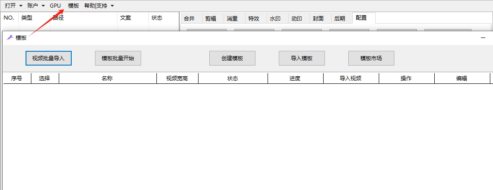

----

### 如何下载

用百度网盘举例
先选择版本，一般选择最新版即可
比如当前最新版是1.1，点击进入
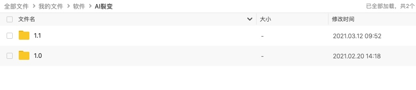

再选择自己对应的系统下载即可
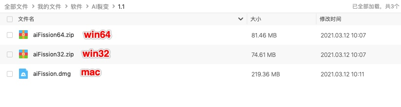

----

### 软件教程

[点击查看](https://qikistudio.gitee.io/)

----
> # 联系我们

| 公众号                          | 微 信                         |
|:----------------------------:|:---------------------------:|
|  |  |
