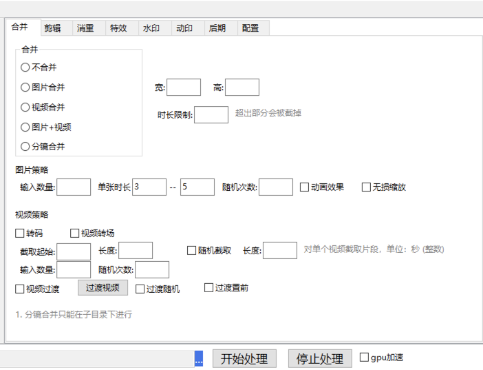

## 合并参数说明

宽高：就是合成视频的分辨率，单位是像素，一般横版视频为1920x1080  竖版视频为1080*1920
时长限制：如果最终合成的视频时长超过这个限制，那么超出的部分会被切掉。

* 图片策略

输入数量：每次合并使用几张图进行合并成一个

单张时长：每张图片显示的时长，如果勾选动画效果，则无法修改图片的时长

随机次数：需要生成几个视频

动画效果：等同于视频的转场，勾选动画效果无法自定义单张图片的时长

无损缩放：使用模糊拓边的效果把图片调整为指定的分辨率大小，不会拉伸图片

* 视频策略

转码：把每个视频进行转码处理

视频转场：视频之间添加转场效果，注意，添加转场后，视频的时长会变小，并且原视频声音会消失

截取起始和长度：针对添加的素材中的视频进行截取，截取完之后再进行合并，比如，起始为1，长度为5，表示从第一秒开始，往后截取5秒。

随机截取：也针对添加的素材中的视频进行截取，比如填5，就是从视频中随机截取5秒，然后再进行合并

输入数量：每次合并使用几个视频进行合并成一个（如果是分镜合并，则表示从每个分镜中取几个视频）

生成数量：生成视频的数量（确保素材足够）

视频过渡：每两个合并的视频的中间插入一个视频

过渡随机：每两个合并的视频的中间插入一个视频，插入的视频每次随机选择，不勾选则按顺序。

过渡前置：这个效果看 [音乐盘点项目](https://qikistudio.gitee.io/)

如果视频衔接处不够流畅，可以勾选转码

[合并输出最大值计算方法](https://qikistudio.gitee.io/)

## 1 [裂变演示](https://qikistudio.gitee.io/)

支持裂变的操作：
消重栏：图片蒙层，混剪，元数据，旋转，伽玛，颜色，

特效栏：抠像，加工样式-背景颜色，加工样式-背景图片，加工样式-背景视频，画中画，gif特效

水印栏：文字水印，图片水印

后期栏：背景音乐，片头，片尾

如果要进行裂变，上面的操作至少要有一个。比如使用背景图片进行裂变，那么图片数量必须大于等于裂变次数。

## 2 [图片合并](https://qikistudio.gitee.io/)

    素材：10张图片，最好填写宽高，否则以第一张图片的宽高作为分辨率    
    
    1. 全部图片合并 + 音乐
    2. 10 张图片，取4张合并，随机4次，每张图片时长3~6秒 + 水印 + 音乐
    3. 10 张图片，取4张合并，随机3次，加动画效果
    4. 10 张图片，取4张合并，随机2次，加动画效果，限制时长8秒
    5. 多目录操作
    6. 无损缩放演示

## 2.1 [图片合并-自定义转场]

[视频演示](https://qikistudio.gitee.io/)

## 3 [视频合并]

[视频演示](https://qikistudio.gitee.io/)

    素材：10个视频，最好填写宽高，否则以第一个视频的宽高作为分辨率     
    
    1. 全部视频合并 + 音乐
    2. 10 个视频，取4个合并，随机3次，每个截取1-4秒 + 水印 + 音乐
    3. 10 个视频，取4个合并，随机3次，加转场效果 + 音乐
    4. 10 个视频，取4个合并，随机2次，限制时长10秒
    5. 10 个视频，取4个合并，随机2次，每个视频之间加过渡
    6. 4 个视频，按顺序合并
    7. 多目录操作

- [无重复视频片段合并的两种方法](https://qikistudio.gitee.io/)

## 4 [图片+视频]

   素材：4张图片，4个视频 ，最好填写宽高，否则以第一个视频的宽高作为分辨率   

1. 全部合并 + 音乐 [视频演示](https://qikistudio.gitee.io/)

2. 取两张图片，取两个视频，随机3次 + 无损缩放 + 音乐 [视频演示](https://qikistudio.gitee.io/)

3. 取两张图片，取两个视频，随机2次，每张图片时长3-6秒，每个视频截取前6秒[视频演示](https://qikistudio.gitee.io/)

4. 取两张图片，取两个视频，随机2次，图片加动画，视频加转场

5. 取两张图片，取两个视频，随机2次，图片加动画，视频加过渡，限制时长10秒 + 音乐

6. 多目录操作

## 5 [分镜合并]

    为方便观看，每个例子单独录制
    素材：4个目录，每个目录3个视频，最好填写宽高，否则以第一个视频的宽高作为分辨率    
    
    分镜至少需要两个目录，分镜整体还是按顺序的，先从第一个目录取视频，再从第二个目录取视频...  
    确保视频的顺序，目录名字按照 001,002,003 命名  

1. 4个目录，每个目录选1个视频，随机3次 + 音乐 [视频演示](https://qikistudio.gitee.io/)

2. 4个目录，每个目录选1个视频，随机2次 + 过渡视频 [视频演示](https://qikistudio.gitee.io/)

3. 4个目录，每个目录选2个视频，随机2次 + 转场 + 水印 + 音乐 [视频演示](https://qikistudio.gitee.io/)

4. 4个目录，每个目录选1个视频，每个视频截取前6秒，随机3次 + 音乐 [视频演示](https://qikistudio.gitee.io/)

5. 4个目录，每个目录选1个视频，每个视频截取前6秒，随机3次 + 音乐 + 时长限制10秒 [视频演示](https://qikistudio.gitee.io/)

## 6 其余功能见AI快剪

## 常见问题

1. 不填输入数量表示全部文件合并，只会输出一个视频
2. 分镜合并的数量计算：每个目录的视频数量相乘即为最大数量，比如最大数为100个，填输出200个，也只能合成100个。合成的视频每个都不重复